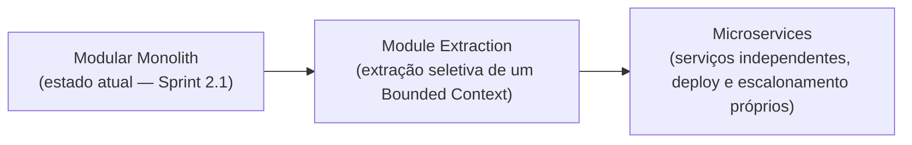

# ADR-001: Adoção de Clean Architecture, DDD, Repository Pattern, Service Layer, Event-Driven Architecture e Modular Monolith

**Status:** Aceita
**Data:** Sprint 2.1
**Autores:** Arquitetura de Software — LeadHunter AI
**Documentos relacionados:** `MASTER_CONTEXT.md`, `ARCHITECTURE.md`, `PROJECT_STRUCTURE.md`

---

## 1. Status

Aceita. Esta decisão é vinculante para todo desenvolvimento futuro do LeadHunter AI a partir da Sprint 2.1. Qualquer proposta de alteração deve ser submetida como uma nova ADR que supere explicitamente esta.

---

## 2. Contexto

O LeadHunter AI é uma plataforma SaaS de prospecção inteligente de empresas, cujo fluxo de negócio central — coleta, análise de presença digital, qualificação, score, aprovação humana, geração de proposta, envio de email, follow-up e sincronização com CRM — envolve múltiplos agentes de IA operando de forma assíncrona, integrações com sistemas externos (provedores de IA, SMTP, CRM) e uma camada de aprovação humana que precisa permanecer auditável e confiável.

O projeto está em estágio de formalização estrutural (Sprint 2.1), sem ainda implementação de código de produção, o que torna este o momento adequado para fixar as decisões arquiteturais fundamentais antes que dívida técnica estrutural se acumule.

Os requisitos não funcionais que motivam esta decisão são:

- **Testabilidade** das regras de qualificação e scoring de leads, isoladas de infraestrutura externa.
- **Substituibilidade** de provedores externos (IA, email, CRM) sem reescrever regras de negócio.
- **Rastreabilidade** de cada transição de estado de um lead, para fins de auditoria e confiança do time comercial no processo automatizado.
- **Evolução incremental** do pipeline de agentes de IA sem necessidade de reescrever o orquestrador a cada novo agente.
- **Velocidade de entrega** compatível com uma equipe pequena, sem a sobrecarga operacional de uma arquitetura de microsserviços prematura.

---

## 3. Problema

Como estruturar o LeadHunter AI de forma que:

1. As regras de negócio de qualificação e scoring de leads não fiquem acopladas a frameworks (FastAPI, Celery, SQLAlchemy) nem a provedores externos de IA;
2. O fluxo assíncrono entre múltiplos agentes de IA seja rastreável, auditável e extensível sem acoplamento direto entre os módulos que o compõem;
3. A equipe consiga entregar valor rapidamente, sem pagar o custo operacional de uma arquitetura de microsserviços distribuída antes de haver necessidade real de escalonamento independente por serviço?

---

## 4. Decisão

O LeadHunter AI adotará, de forma combinada e vinculante:

1. **Clean Architecture**, com quatro camadas concêntricas (`domain`, `application`, `infrastructure`, `presentation`), regra de dependência unidirecional apontando sempre para o `domain`.
2. **Domain-Driven Design (DDD)**, organizando o sistema em Bounded Contexts (Prospecting, Qualification, Scoring, Approval, Proposal, Outreach, CRM Sync), cada um com sua própria linguagem ubíqua e suas próprias entidades.
3. **Repository Pattern**, com uma interface abstrata por agregado raiz definida em `domain/interfaces` e implementação concreta em `infrastructure`.
4. **Service Layer**, para orquestração de regras de negócio que cruzam múltiplos repositórios e integrações, mantendo os casos de uso (`use_cases`) enxutos.
5. **Event-Driven Architecture**, como único mecanismo de comunicação entre `apps/api` e `apps/worker`, com eventos de domínio versionados e catalogados.
6. **Modular Monolith**, deployando o sistema como três processos (`api`, `worker`, `web`) internamente organizados por Bounded Context, adiando a extração para microsserviços até haver evidência concreta de necessidade de escalonamento independente.

Estas decisões estão detalhadas operacionalmente em `docs/ARCHITECTURE.md` e `docs/PROJECT_STRUCTURE.md`.

---

## 5. Consequências

### 5.1 Consequências positivas

- Regras de qualificação e scoring podem ser testadas unitariamente sem banco de dados, sem rede e sem chamar provedores reais de IA.
- Novos agentes de IA podem ser adicionados implementando o contrato `BaseAgent`, sem alterar o orquestrador existente (aderência ao princípio Open/Closed).
- A substituição de um provedor de IA, de um provedor de email ou do CRM externo é isolada à camada `infrastructure/integrations`, sem impacto em `domain` ou `application`.
- O catálogo de eventos de domínio fornece rastreabilidade completa do ciclo de vida de um lead, essencial para auditoria do processo de aprovação humana.
- A operação de um Modular Monolith é significativamente mais simples do que uma arquitetura distribuída de microsserviços, adequada ao estágio atual da equipe e do produto.

### 5.2 Consequências negativas e riscos assumidos

- Maior verbosidade inicial: a separação em camadas exige mais arquivos e mais indireção (interfaces, mappers, DTOs) do que uma abordagem direta acoplada ao framework.
- Curva de aprendizado para desenvolvedores não familiarizados com Clean Architecture e DDD, mitigada pela documentação detalhada em `ARCHITECTURE.md` e pelas convenções em `DEVELOPMENT_CONVENTIONS.md`.
- O Modular Monolith exige disciplina de equipe para não permitir acoplamento indevido entre módulos internos — risco mitigado por regras de lint de fronteira de importação (`import-linter`), descritas em `PROJECT_STRUCTURE.md`.
- Eventos de domínio introduzem consistência eventual entre `api` e `worker`, que deve ser comunicada claramente à experiência do usuário no frontend (ex.: estados intermediários de processamento visíveis no dashboard).

### 5.3 Consequências de reversão

Caso, em uma fase futura, seja necessário extrair um Bounded Context para um serviço independente (por exemplo, o pipeline de agentes de IA por questões de escalonamento de GPU/custo), a separação já existente por Bounded Context e a comunicação via eventos tornam essa extração incremental e localizada, sem exigir reescrita das regras de negócio.

---

## 6. Alternativas consideradas

### 6.1 Arquitetura em camadas simples (MVC tradicional, sem Clean Architecture)

Descartada por acoplar diretamente as regras de qualificação de leads ao ORM e ao framework web, dificultando testes unitários e a futura substituição de provedores de IA.

### 6.2 Microsserviços desde o início (um serviço por Bounded Context)

Descartada nesta fase por introduzir complexidade operacional (deploy independente, observabilidade distribuída, versionamento de contratos entre serviços via rede) desproporcional ao estágio atual do produto e ao tamanho da equipe. O Modular Monolith preserva a possibilidade de extração futura sem pagar esse custo antecipadamente.

### 6.3 Comunicação síncrona direta entre API e Worker (chamada HTTP interna em vez de eventos)

Descartada por criar acoplamento temporal forte entre etapas do pipeline (coleta, qualificação, score, proposta), o que é incompatível com a natureza naturalmente assíncrona e sujeita a retries do processamento de IA em lote.

### 6.4 Active Record em vez de Repository Pattern

Descartada por acoplar a entidade de domínio diretamente ao mecanismo de persistência, violando a independência de framework exigida pela Clean Architecture e dificultando a criação de implementações in-memory para testes.

### 6.5 Domain Model anêmico com lógica concentrada em services

Descartada como padrão geral: optou-se por um modelo de domínio rico, no qual entidades como `Lead` garantem suas próprias invariantes (`lead.approve()`, `lead.qualify()`), reservando os `services` para orquestração entre múltiplos agregados e integrações, não para conter regra de negócio que pertence a uma única entidade.

---

## 7. Trade-offs

| Dimensão | Ganho com esta decisão | Custo assumido |
|---|---|---|
| Testabilidade | Alta — domínio isolado de infraestrutura | Mais arquivos de teste e mocks a manter |
| Velocidade de entrega inicial | Moderada — estrutura já definida evita retrabalho | Mais boilerplate inicial por camada |
| Complexidade operacional | Baixa — Modular Monolith com poucos processos | Disciplina exigida para não acoplar módulos internos |
| Extensibilidade do pipeline de agentes | Alta — novos agentes sem alterar orquestrador | Contrato `BaseAgent` deve ser mantido estável |
| Rastreabilidade de negócio | Alta — eventos de domínio catalogados e versionados | Consistência eventual entre módulos |

---

## 8. Justificativa consolidada

A combinação de Clean Architecture, DDD, Repository Pattern, Service Layer, Event-Driven Architecture e Modular Monolith foi escolhida por oferecer o melhor equilíbrio, para o estágio atual do LeadHunter AI, entre:

- **Rigor arquitetural** suficiente para suportar um pipeline de múltiplos agentes de IA operando sobre dados sensíveis de prospecção comercial, com necessidade de auditoria e confiança do time humano no processo;
- **Simplicidade operacional** compatível com uma equipe de desenvolvimento enxuta, evitando a complexidade prematura de uma arquitetura distribuída;
- **Flexibilidade futura**, uma vez que a separação por Bounded Context e a comunicação via eventos preservam a opção de extração para microsserviços caso o crescimento do produto venha a exigir escalonamento independente de um módulo específico, sem que isso demande uma reescrita das regras de negócio já validadas.

Esta decisão é considerada a base arquitetural oficial do projeto a partir da Sprint 2.1 e deve ser referenciada por qualquer ADR futura que proponha sua alteração parcial ou total.

---

## 9. Future Evolution (Estratégia de Evolução)

Esta seção registra, de forma explícita, o caminho de evolução arquitetural previsto para o LeadHunter AI, para que a transição — caso venha a ser necessária — seja incremental e planejada, e não uma reescrita reativa sob pressão de escala.

### 9.1 Estágio atual — Modular Monolith

Estado vigente desta ADR: três processos de deploy (`api`, `worker`, `web`), módulos internos isolados por Bounded Context, comunicação entre módulos exclusivamente via eventos de domínio. Este estágio é mantido enquanto a equipe e a carga do sistema não exigirem escalonamento ou ciclo de deploy independente por módulo.

### 9.2 Gatilhos para Module Extraction

A extração de um módulo específico do monolito para um serviço próprio deve ser considerada quando pelo menos um dos gatilhos abaixo for observado, e formalizada através de uma nova ADR antes de ser executada:

- Um Bounded Context passa a exigir um perfil de infraestrutura significativamente distinto dos demais (por exemplo, os agentes de IA passam a demandar processamento em GPU, enquanto o restante do sistema permanece em CPU convencional).
- Um Bounded Context precisa escalar horizontalmente em uma cadência muito diferente dos demais módulos (por exemplo, picos de coleta de empresas desproporcionais ao volume de aprovações humanas).
- Um Bounded Context passa a ser mantido por uma equipe própria, com ciclo de release independente do restante do produto.
- Um Bounded Context atinge um volume de dados ou de requisições que degrada a performance dos demais módulos ao compartilhar o mesmo processo.

### 9.3 Pré-condições que tornam a extração viável

A viabilidade de extração futura é garantida, desde a Sprint 2.1, pelas seguintes decisões já adotadas nesta ADR:

- Separação por Bounded Context já existente no código, sem acoplamento direto entre módulos (seção 4 e `PROJECT_STRUCTURE.md`, seção 9 "Fronteiras de importação").
- Comunicação exclusivamente via eventos de domínio versionados (seção 9 de `ARCHITECTURE.md`), o que significa que um módulo extraído continua se comunicando pelo mesmo contrato, apenas trocando o transporte de eventos in-process por um broker de mensageria dedicado.
- Repositórios e interfaces de domínio já isolados por agregado, permitindo que um módulo extraído leve consigo seu próprio armazenamento de dados sem refatoração de regra de negócio.

### 9.4 Estágio final — Microservices

Etapa considerada apenas quando múltiplos módulos já tiverem sido extraídos individualmente e a organização (equipe, operação, observabilidade distribuída) comportar o custo de uma arquitetura totalmente distribuída. Esta ADR não determina uma data ou obrigatoriedade para esta etapa — ela é registrada apenas como o horizonte de evolução possível, condicionado aos gatilhos da seção 9.2.

Qualquer extração de módulo, parcial ou total, deve ser proposta como uma nova ADR, que referencia esta ADR-001 e descreve especificamente qual Bounded Context está sendo extraído, o gatilho que motivou a decisão e o plano de migração de dados e de eventos.
