# ARCHITECTURE.md

**Projeto:** LeadHunter AI
**Documento:** Arquitetura Oficial do Sistema
**Versão:** 1.0.0
**Sprint de origem:** 2.1
**Fonte de verdade relacionada:** `MASTER_CONTEXT.md`, `PROJECT_STRUCTURE.md`

---

## 1. Visão geral

O LeadHunter AI é uma plataforma SaaS de prospecção inteligente de empresas, construída como um **Modular Monolith** dividido em três aplicações (`api`, `worker`, `web`), seguindo **Clean Architecture**, **Domain-Driven Design (DDD)** e princípios **SOLID**, com comunicação assíncrona baseada em eventos entre os módulos de domínio.

Este documento é a referência arquitetural oficial e vinculante do projeto. Qualquer decisão que o contrarie deve primeiro ser registrada como uma nova ADR em `docs/ADRs/`.

---

## 2. Princípios arquiteturais

1. **Independência de framework**: as regras de negócio (camada `domain`) não conhecem FastAPI, Celery, SQLAlchemy ou Next.js.
2. **Testabilidade**: toda regra de negócio deve ser testável sem banco de dados, sem rede e sem IA real.
3. **Explicitação de contratos**: toda dependência externa é acessada através de uma interface definida no domínio.
4. **Eventos como fonte de integração**: `api` e `worker` nunca se chamam diretamente; comunicam-se por eventos de domínio.
5. **Modularidade dentro do monolito**: cada Bounded Context é isolado internamente, mesmo compartilhando o mesmo processo de deploy.
6. **Decisões documentadas**: toda escolha arquitetural relevante é registrada como ADR.

---

## 3. Fluxo completo do pipeline de negócio (MASTER_CONTEXT)

Este é o fluxo de ponta a ponta definido em `MASTER_CONTEXT.md` como a fonte de verdade do produto. Todo desenho de módulos, agentes e eventos deste documento deriva diretamente deste fluxo.

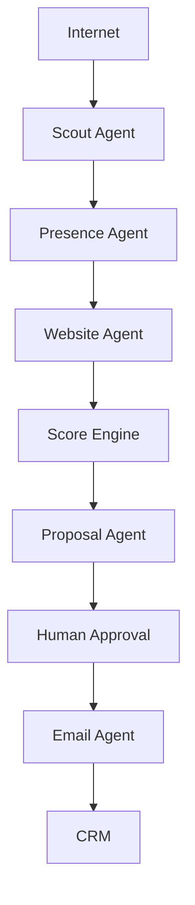

### 3.1 Correspondência entre o fluxo do MASTER_CONTEXT e os módulos técnicos

A tabela abaixo mapeia cada etapa do fluxo oficial de negócio para o Bounded Context e o componente técnico correspondente, definidos na seção 5 e detalhados em `PROJECT_STRUCTURE.md`.

| Etapa (MASTER_CONTEXT) | Bounded Context | Componente técnico |
|---|---|---|
| Scout Agent | Prospecting | `agents/collector_agent` |
| Presence Agent | Qualification | `agents/qualifier_agent` |
| Website Agent | Qualification | `agents/qualifier_agent` |
| Score Engine | Scoring | `agents/scoring_agent` |
| Proposal Agent | Proposal | `agents/proposal_agent` |
| Human Approval | Approval | `application/use_cases/approve_lead.py` |
| Email Agent | Outreach | `tasks/email_tasks.py` |
| CRM | CRM Sync | `consumers/crm_sync_consumer.py` |

A nomenclatura interna de código (`collector_agent`, `qualifier_agent`, `scoring_agent`) é a implementação técnica das etapas nomeadas no fluxo de negócio do MASTER_CONTEXT (`Scout Agent`, `Presence Agent` / `Website Agent`, `Score Engine`). As duas nomenclaturas coexistem intencionalmente: o MASTER_CONTEXT descreve o fluxo na linguagem do negócio, enquanto `PROJECT_STRUCTURE.md` e este documento descrevem a mesma etapa na linguagem de implementação. Nenhuma nova etapa pode ser adicionada a um dos dois documentos sem atualização correspondente no outro.

---

## 4. Clean Architecture

A Clean Architecture organiza o código em camadas concêntricas, onde as dependências apontam sempre para dentro — em direção ao domínio — e nunca para fora.

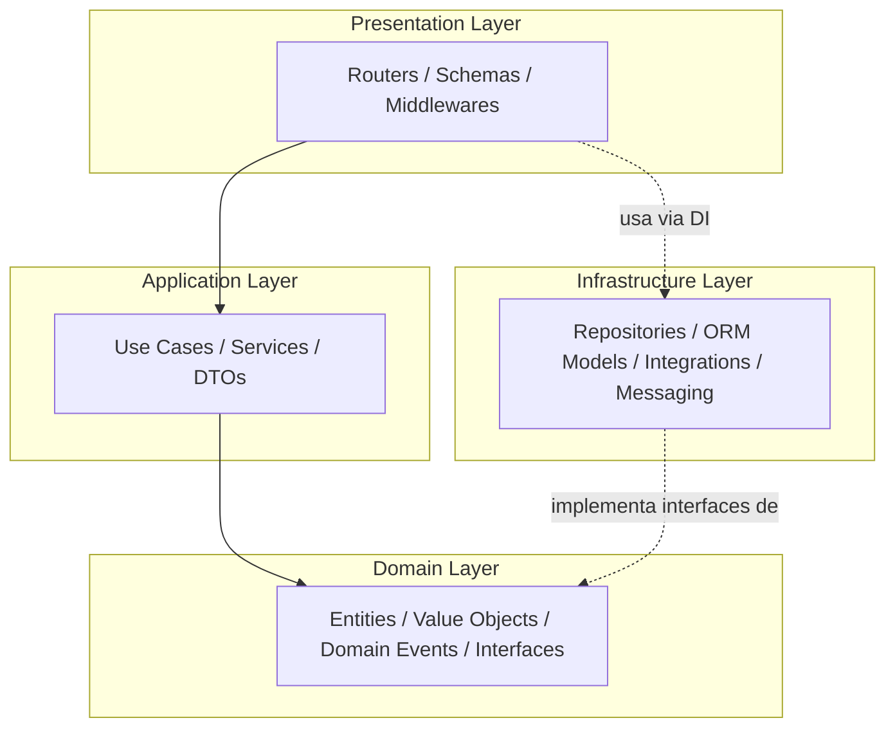

### 3.1 Regra de dependência

- `domain` não depende de nenhuma outra camada.
- `application` depende apenas de `domain`.
- `infrastructure` depende de `domain` (implementa suas interfaces) mas nunca de `application`.
- `presentation` depende de `application` e é composta via injeção de dependência com `infrastructure`.

Violação típica a evitar: um `use_case` importando um `Model` do SQLAlchemy diretamente, ao invés de depender da interface de repositório.

---

## 5. Domain-Driven Design (DDD)

### 4.1 Bounded Contexts

| Bounded Context | Responsabilidade | Localização |
|---|---|---|
| **Prospecting** | Coleta e cadastro de empresas candidatas a lead | `domain/entities/company.py`, `agents/collector_agent` |
| **Qualification** | Análise de presença digital e qualificação do lead | `agents/qualifier_agent` |
| **Scoring** | Cálculo de pontuação e priorização de leads | `agents/scoring_agent` |
| **Approval** | Fluxo de aprovação humana sobre leads qualificados | `application/use_cases/approve_lead.py` |
| **Proposal** | Geração de propostas comerciais assistida por IA | `agents/proposal_agent` |
| **Outreach** | Envio de email, follow-up e rastreamento de resposta | `tasks/email_tasks.py` |
| **CRM Sync** | Sincronização do lead qualificado com o CRM externo | `consumers/crm_sync_consumer.py` |

Cada Bounded Context possui sua própria linguagem ubíqua, suas próprias entidades e não compartilha modelos internos com outro contexto — a comunicação entre contextos ocorre exclusivamente via eventos de domínio.

### 4.2 Entidades e Value Objects

| Elemento | Tipo | Exemplo |
|---|---|---|
| `Lead` | Entidade | Possui identidade própria (`lead_id`), ciclo de vida e estado mutável (`status`) |
| `Company` | Entidade | Representa a empresa prospectada, com identidade própria (`company_id`) |
| `Score` | Value Object | Imutável, definido por `(value: float, criteria: list[Criterion])` |
| `Email` | Value Object | Imutável, validado na construção |
| `DigitalPresence` | Value Object | Agregação imutável dos sinais coletados (site, redes sociais, avaliações) |

### 4.3 Agregados

O agregado raiz `Lead` encapsula `Company`, `Score` e `DigitalPresence`, garantindo que qualquer transição de estado (`collected → qualified → scored → approved → proposed → contacted → converted`) passe por um único ponto de entrada: o método de domínio do agregado, nunca por atribuição direta de atributos a partir da camada de aplicação.

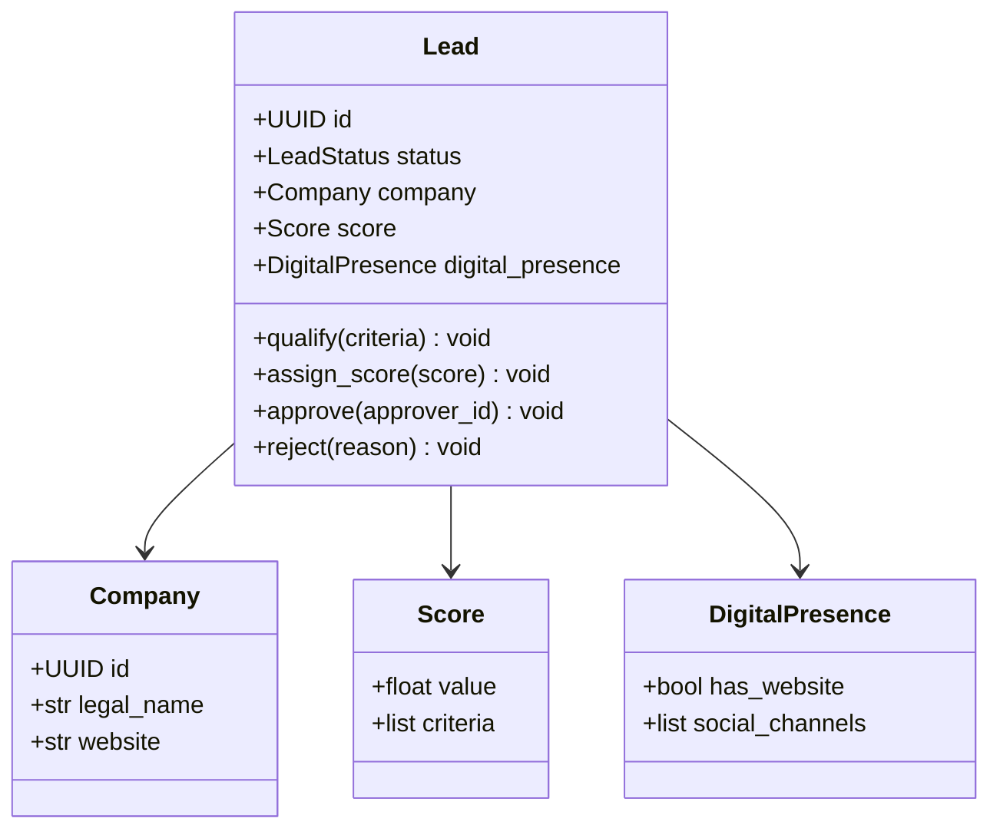

---

## 6. SOLID aplicado ao projeto

| Princípio | Aplicação concreta no LeadHunter AI |
|---|---|
| **S**ingle Responsibility | Cada `use_case` executa exatamente uma ação de negócio (ex.: `ApproveLeadUseCase` apenas aprova) |
| **O**pen/Closed | Novos agentes de IA são adicionados implementando `BaseAgent`, sem alterar o orquestrador existente |
| **L**iskov Substitution | Qualquer implementação de `LeadRepositoryInterface` (Postgres, in-memory para testes) é substituível sem quebrar os use cases |
| **I**nterface Segregation | Interfaces de repositório são específicas por agregado (`LeadRepositoryInterface`, `CompanyRepositoryInterface`), nunca uma interface genérica "God Repository" |
| **D**ependency Inversion | `application` depende de `domain/interfaces`, e `infrastructure` é injetada em tempo de execução via FastAPI `Depends` ou Celery factory |

---

## 7. Repository Pattern

Cada agregado possui uma interface abstrata em `domain/interfaces` e uma implementação concreta em `infrastructure/database/repositories`.

```python
# domain/interfaces/lead_repository.py
from typing import Protocol
from uuid import UUID
from leadhunter_api.domain.entities.lead import Lead


class LeadRepositoryInterface(Protocol):
    async def get_by_id(self, lead_id: UUID) -> Lead | None: ...
    async def save(self, lead: Lead) -> None: ...
    async def list_pending_approval(self, limit: int, offset: int) -> list[Lead]: ...
```

```python
# infrastructure/database/repositories/sqlalchemy_lead_repository.py
from uuid import UUID
from sqlalchemy.ext.asyncio import AsyncSession
from leadhunter_api.domain.entities.lead import Lead
from leadhunter_api.domain.interfaces.lead_repository import LeadRepositoryInterface
from leadhunter_api.infrastructure.database.models.lead_model import LeadModel
from leadhunter_api.infrastructure.database.mappers.lead_mapper import LeadMapper


class SqlAlchemyLeadRepository(LeadRepositoryInterface):
    def __init__(self, session: AsyncSession) -> None:
        self._session = session

    async def get_by_id(self, lead_id: UUID) -> Lead | None:
        model = await self._session.get(LeadModel, lead_id)
        return LeadMapper.to_entity(model) if model else None

    async def save(self, lead: Lead) -> None:
        model = LeadMapper.to_model(lead)
        await self._session.merge(model)
        await self._session.flush()

    async def list_pending_approval(self, limit: int, offset: int) -> list[Lead]:
        from sqlalchemy import select
        stmt = (
            select(LeadModel)
            .where(LeadModel.status == "qualified")
            .limit(limit)
            .offset(offset)
        )
        result = await self._session.execute(stmt)
        return [LeadMapper.to_entity(m) for m in result.scalars().all()]
```

O mapeamento entre `LeadModel` (ORM) e `Lead` (entidade de domínio) é sempre explícito via um `Mapper` dedicado, nunca implícito por herança entre entidade e modelo.

---

## 8. Service Layer

Os `application/services` orquestram múltiplos repositórios e integrações para realizar uma operação de negócio que não se resume a um único caso de uso simples.

```python
# application/services/lead_qualification_service.py
from leadhunter_api.domain.interfaces.lead_repository import LeadRepositoryInterface
from leadhunter_api.domain.interfaces.digital_presence_analyzer import DigitalPresenceAnalyzerInterface
from leadhunter_api.domain.events.lead_events import LeadQualifiedEvent
from leadhunter_api.infrastructure.messaging.event_publisher import EventPublisherInterface


class LeadQualificationService:
    def __init__(
        self,
        lead_repository: LeadRepositoryInterface,
        presence_analyzer: DigitalPresenceAnalyzerInterface,
        event_publisher: EventPublisherInterface,
    ) -> None:
        self._lead_repository = lead_repository
        self._presence_analyzer = presence_analyzer
        self._event_publisher = event_publisher

    async def qualify(self, lead_id):
        lead = await self._lead_repository.get_by_id(lead_id)
        if lead is None:
            raise ValueError("Lead não encontrado")

        presence = await self._presence_analyzer.analyze(lead.company)
        lead.qualify(presence)

        await self._lead_repository.save(lead)
        await self._event_publisher.publish(LeadQualifiedEvent(lead_id=lead.id))
```

---

## 9. Dependency Injection

A injeção de dependência é realizada nativamente via FastAPI `Depends` na camada de apresentação, e via *factories* explícitas na inicialização das tasks Celery no worker. Nenhuma classe de `application` ou `infrastructure` instancia suas próprias dependências internamente.

```python
# presentation/api/v1/dependencies.py
from fastapi import Depends
from sqlalchemy.ext.asyncio import AsyncSession
from leadhunter_api.infrastructure.database.session import get_db_session
from leadhunter_api.infrastructure.database.repositories.sqlalchemy_lead_repository import SqlAlchemyLeadRepository
from leadhunter_api.application.services.lead_qualification_service import LeadQualificationService


def get_lead_repository(session: AsyncSession = Depends(get_db_session)) -> SqlAlchemyLeadRepository:
    return SqlAlchemyLeadRepository(session)


def get_lead_qualification_service(
    lead_repository: SqlAlchemyLeadRepository = Depends(get_lead_repository),
) -> LeadQualificationService:
    return LeadQualificationService(
        lead_repository=lead_repository,
        presence_analyzer=get_digital_presence_analyzer(),
        event_publisher=get_event_publisher(),
    )
```

---

## 10. Event-Driven Architecture

Toda transição relevante de estado de um `Lead` é publicada como um evento de domínio. Eventos são a única forma de comunicação entre `apps/api` e `apps/worker`.

### 9.1 Catálogo de eventos

| Evento | Publicado por | Consumido por | Propósito |
|---|---|---|---|
| `CompanyCollectedEvent` | Collector Agent | Qualifier Agent | Inicia a análise de presença digital |
| `LeadQualifiedEvent` | Qualifier Agent | Scoring Agent | Inicia o cálculo de score |
| `LeadScoredEvent` | Scoring Agent | API (fila de aprovação) | Disponibiliza o lead para aprovação humana |
| `LeadApprovedEvent` | API (Approval use case) | Proposal Agent | Inicia a geração da proposta |
| `LeadRejectedEvent` | API (Approval use case) | CRM Sync Consumer | Registra a rejeição no CRM |
| `ProposalGeneratedEvent` | Proposal Agent | Outreach Task | Inicia o envio de email |
| `EmailSentEvent` | Outreach Task | CRM Sync Consumer | Sincroniza status com o CRM |
| `FollowUpDueEvent` | Scheduler (Celery beat) | Outreach Task | Dispara follow-up agendado |

### 9.2 Fluxo de eventos completo

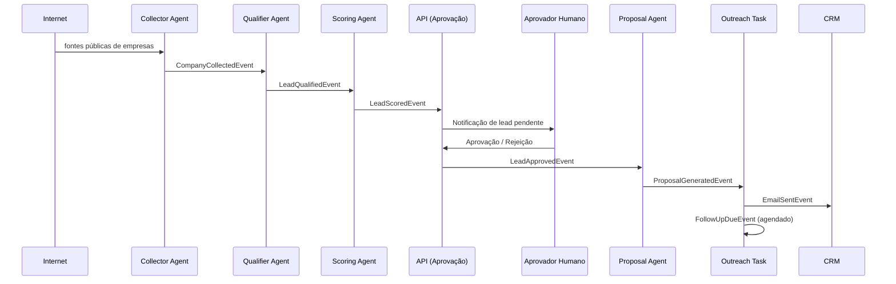

### 9.3 Contrato de evento

```python
# packages/domain-core/src/domain_core/events/lead_events.py
from dataclasses import dataclass
from datetime import datetime, timezone
from uuid import UUID


@dataclass(frozen=True)
class LeadQualifiedEvent:
    event_name: str = "lead.qualified.v1"
    lead_id: UUID = None
    occurred_at: datetime = None

    def __post_init__(self):
        object.__setattr__(self, "occurred_at", self.occurred_at or datetime.now(timezone.utc))
```

Todo evento é versionado no próprio nome (`lead.qualified.v1`). Uma mudança incompatível de schema exige a criação de `lead.qualified.v2`, nunca a alteração retroativa do evento existente.

---

## 11. Modular Monolith

O LeadHunter AI é deployado como poucos processos (`api`, `worker`, `web`), mas internamente organizado como módulos fortemente isolados por Bounded Context. Essa escolha, formalizada na ADR-001, equilibra a simplicidade operacional de um monolito com a organização de domínio de microsserviços, adiando a decisão de extração para serviços independentes até que haja evidência real de necessidade de escalonamento isolado.

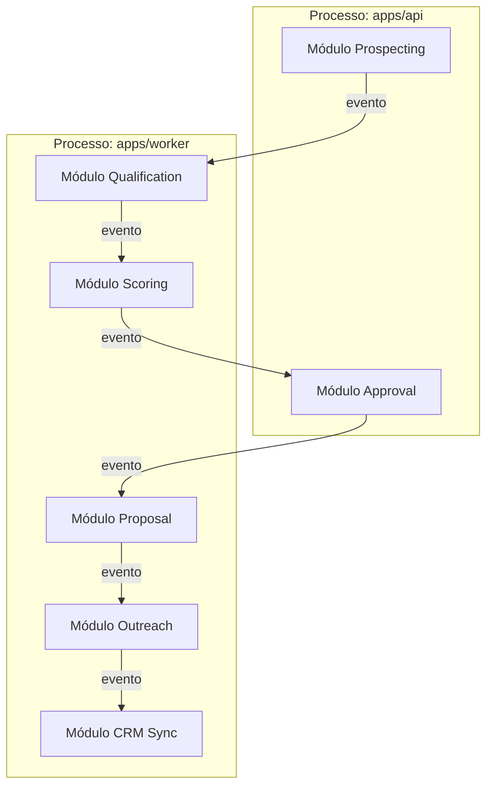

---

## 12. Diagrama C4 — Nível 1: Contexto do Sistema

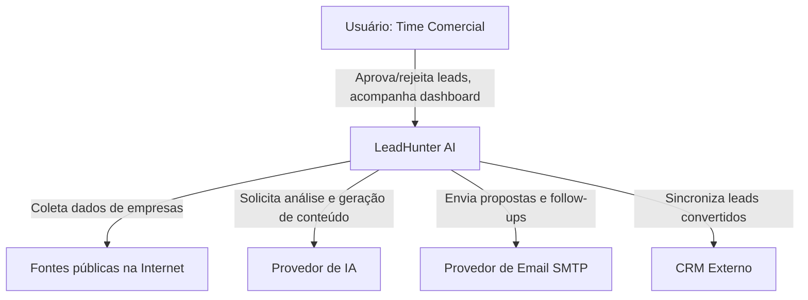

## 13. Diagrama C4 — Nível 2: Containers

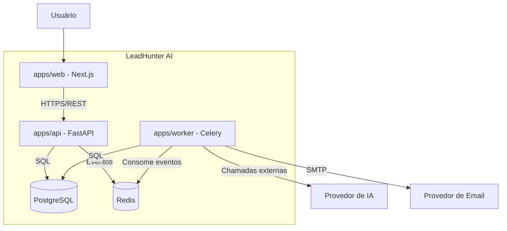

## 14. Diagrama C4 — Nível 3: Componentes da API

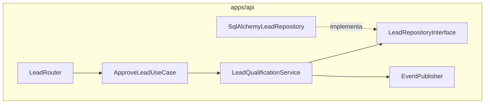

---

## 15. Fluxo completo da requisição HTTP

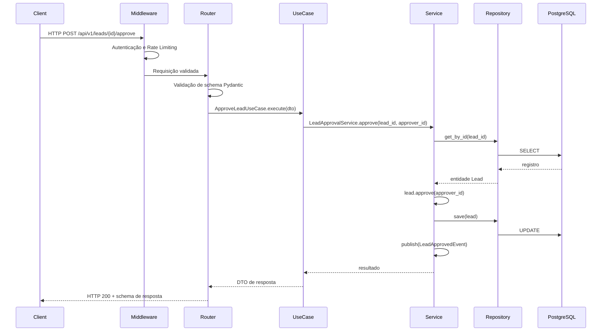

## 16. Fluxo dos agentes de IA

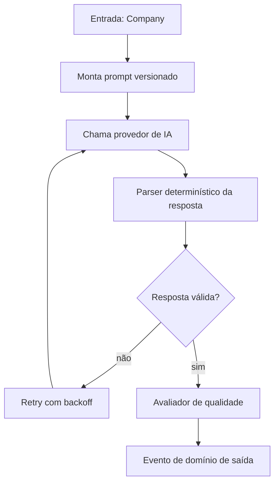

Todo agente segue o contrato único `BaseAgent.run(input) -> AgentResult`, garantindo que orquestração, retries e observabilidade sejam padronizados independentemente do agente específico.

## 17. Fluxo do banco de dados

- Toda escrita passa obrigatoriamente por um repositório concreto — nunca por acesso direto a `Session` fora de `infrastructure/database`.
- Toda leitura de consulta complexa (relatórios, dashboards) é implementada como método explícito no repositório, nunca via query ad-hoc na camada de aplicação.
- Migrations são geradas via Alembic e revisadas manualmente antes do merge.

## 18. Fluxo da IA

O provedor de IA é acessado exclusivamente através de `infrastructure/integrations/ai_providers`, que implementa a interface `AIProviderInterface` definida em `domain/interfaces`. Isso garante que a troca de provedor de IA não exija alteração em nenhum agente.

---

## 19. Responsabilidades por componente

| Componente | Responsabilidade | Não deve fazer |
|---|---|---|
| **Controllers (Routers)** | Validar entrada HTTP, invocar use case, formatar resposta | Conter regra de negócio |
| **Services** | Orquestrar múltiplos repositórios/integrações para uma operação de negócio | Conhecer detalhes de framework HTTP |
| **Repositories** | Persistir e recuperar entidades, traduzindo entre ORM e domínio | Conter regra de negócio |
| **Schemas (Pydantic)** | Validar e serializar dados na borda da API | Ser reutilizado como modelo de domínio |
| **Models (SQLAlchemy)** | Mapear tabelas do banco | Conter lógica de negócio |
| **Workers (Celery tasks)** | Delegar execução para agentes, controlar retries e filas | Conter lógica de negócio complexa diretamente na task |
| **Agents** | Executar uma etapa específica do pipeline de IA | Persistir dados diretamente sem passar por repositório |
| **Events** | Representar fatos ocorridos no domínio, imutáveis | Carregar lógica executável |
| **Tasks** | Ponto de entrada assíncrono, fino, delegando para agents/services | Concentrar regras de negócio |
| **Utils** | Funções puras, sem estado, sem efeitos colaterais | Acessar banco de dados ou rede |
| **Integrations** | Traduzir entre o contrato externo e o contrato interno do domínio | Vazar formato de dados do provedor externo para o domínio |

---

## 20. Anti-padrões proibidos no projeto

| Anti-padrão | Por que é proibido | Alternativa correta |
|---|---|---|
| **Fat Controller** | Router concentrando regra de negócio | Delegar para `use_case` |
| **Anemic Domain Model** | Entidades sem comportamento, apenas getters/setters | Métodos de domínio que garantem invariantes (`lead.approve()`) |
| **God Repository** | Um único repositório genérico para todas as entidades | Um repositório por agregado |
| **Service Locator** | Resolver dependências manualmente dentro da classe | Injeção de dependência explícita via construtor |
| **Import direto entre `api` e `worker`** | Quebra o isolamento e cria acoplamento síncrono indevido | Comunicação via eventos |
| **Lógica de negócio em migration** | Migrations devem alterar apenas schema | Lógica de dados pertence a scripts de `scripts/`, nunca a migrations |
| **Exception genérica sem contexto** | Dificulta rastreamento de erro | Exceções de domínio tipadas (`LeadNotFoundError`) |

---

## 21. Camadas da aplicação — resumo consolidado

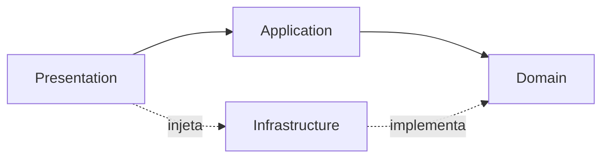

| Camada | Conhece | Não conhece |
|---|---|---|
| Domain | Regras de negócio puras | FastAPI, SQLAlchemy, Celery |
| Application | Domain | Detalhes de HTTP, SQL, filas |
| Infrastructure | Domain (interfaces) | Application, Presentation |
| Presentation | Application | Infrastructure concreta (apenas via DI) |

---

## 22. Critérios de aceite deste documento

- [ ] Todo Bounded Context listado possui pelo menos uma entidade e um evento correspondente no código.
- [ ] Todo evento publicado está catalogado na seção 10.1.
- [ ] Nenhuma camada viola a regra de dependência descrita na seção 4.1.
- [ ] Os diagramas C4 refletem os containers reais em produção.
- [ ] Toda nova decisão que altere este documento gera uma ADR correspondente.
