# MASTER_CONTEXT.md
### LeadHunter AI — Documentação Oficial de Engenharia (Single Source of Truth)

> Versão: 1.0.0 · Status: Draft para validação inicial (MVP) · Última atualização: 2026-07-01
> Este documento é a fonte única e oficial de conhecimento sobre o LeadHunter AI. Toda ferramenta de IA (ChatGPT, Claude, Gemini, Cursor, Cline, Windsurf, Copilot, Continue.dev) e todo desenvolvedor humano deve utilizar este documento como contexto primário antes de gerar, revisar ou alterar qualquer artefato do sistema.

---

## Como Ler Este Documento (Diátaxis)

Este documento combina quatro modos de conhecimento, seguindo o framework Diátaxis:

| Modo | Seções correspondentes | Uso |
|---|---|---|
| **Explicação** (entender o porquê) | 1, 2, 3, 8, 12, 17, 18, 21 | Entender motivações e modelo mental do sistema |
| **Referência** (consultar fatos) | 6, 7, 11, 14, 16, 29 | Consultar contratos, schemas, endpoints |
| **Tutorial/How-to** (fazer algo) | 10, 15, 24 | Executar pipelines, escrever prompts, fazer deploy |
| **Decisões** (por que assim e não de outro jeito) | 27 (ADRs) | Justificativa histórica de escolhas técnicas |

---

## 1. Visão Executiva

### 1.1 Missão
Eliminar o trabalho manual e ineficiente de prospecção de clientes para profissionais e agências de desenvolvimento web, substituindo-o por um sistema multiagente de IA capaz de identificar, qualificar e iniciar contato com empresas que possuem baixa maturidade digital — de forma autônoma, escalável e mensurável.

### 1.2 Visão
Tornar-se a infraestrutura padrão de geração de demanda para o mercado de serviços digitais B2B, primeiro como ferramenta interna de um único operador (o desenvolvedor fundador), depois como plataforma SaaS multiusuário.

### 1.3 Proposta de Valor
- **Para o operador solo/freelancer**: substitui dezenas de horas semanais de prospecção manual (busca no Google Maps, análise de sites, redação de e-mails) por um pipeline automatizado que entrega leads pré-qualificados e prontos para contato.
- **Diferencial central**: o sistema não apenas *lista* empresas — ele **avalia a maturidade digital real** de cada uma (site desatualizado, ausência de SEO, ausência de presença em redes sociais, performance ruim) e prioriza por probabilidade de conversão através de um **Sistema de Score** (Seção 17).
- **Efeito composto**: cada lead gerado alimenta uma base de conhecimento (Seção 19) que melhora a qualidade de segmentação e da escrita de propostas ao longo do tempo.

### 1.4 Objetivos de Alto Nível
1. Validar a geração recorrente de leads qualificados para o próprio desenvolvedor (fase pré-produto).
2. Medir taxa de conversão de lead → cliente pagante.
3. Somente após validação de receita, evoluir a arquitetura para multiusuário (SaaS).

### 1.5 Diferenciais
- Arquitetura **multiagente especializada** (não um único LLM genérico fazendo tudo).
- Pipeline determinístico com **pontos de IA isolados e auditáveis** (cada agente tem entrada/saída tipada).
- Foco vertical: apenas o nicho de empresas com baixa maturidade digital que precisam de serviços de desenvolvimento web.
- Score de qualificação objetivo e explicável, não uma "caixa preta".

---

## 2. Problema de Negócio

### 2.1 Dores do Mercado
Freelancers, agências pequenas e consultores de desenvolvimento web enfrentam três dores centrais:

1. **Prospecção manual é lenta e não escala.** Buscar empresas no Google Maps, abrir cada site, avaliar manualmente se "vale a pena" abordar, e escrever e-mails personalizados consome, em média, de 15 a 30 minutos por lead qualificado.
2. **Qualificação inconsistente.** Sem critérios objetivos, o profissional prospecta empresas que já têm um site moderno (baixo potencial) ou empresas sem qualquer intenção de investir (sem orçamento), desperdiçando esforço.
3. **Ausência de funil estruturado.** A maioria dos freelancers não possui CRM, follow-up sistemático, nem métricas de conversão — cada ciclo de prospecção recomeça do zero.

### 2.2 Situação Atual (Baseline)
- Prospecção 100% manual via Google Maps + Instagram + análise visual de sites.
- Nenhuma automação de contato inicial.
- Nenhum sistema de score ou priorização.
- Follow-up feito de forma ad-hoc (ou inexistente).

### 2.3 Custo da Prospecção Manual
| Atividade | Tempo médio manual | Custo de oportunidade (hora do profissional) |
|---|---|---|
| Buscar e listar empresas em uma região/nicho | 20 leads/hora | Alto — tempo não faturável |
| Analisar maturidade digital de cada site | 5–10 min/lead | Alto |
| Redigir e-mail/proposta personalizada | 10–15 min/lead | Muito alto |
| Follow-up | Raramente feito | Perda de receita (leads mortos) |

### 2.4 Impacto Financeiro
Considerando uma hora faturável média de R$ 80–150 no mercado de desenvolvimento web freelance, cada hora gasta em prospecção manual representa receita não gerada. Automatizar 80% desse esforço libera capacidade produtiva diretamente proporcional a novas propostas enviadas — e, por extensão, a novos contratos fechados.

---

## 3. Objetivos

### 3.1 Curto Prazo (0–3 meses) — Fase MVP
- Pipeline funcional ponta a ponta para **um único operador** (o desenvolvedor).
- Coleta automatizada de empresas em um nicho e região definidos.
- Score de maturidade digital funcional.
- Geração automática de e-mail de contato personalizado.
- Meta: **gerar 50 leads qualificados/semana** com score ≥ 70.

### 3.2 Médio Prazo (3–9 meses) — Fase V1
- Follow-up automatizado (sequência de e-mails).
- Geração automática de landing page de proposta personalizada por lead.
- Integração com CRM leve (Notion, Airtable ou CRM próprio).
- Meta: **taxa de resposta ≥ 8%**, **taxa de conversão lead → reunião ≥ 3%**.

### 3.3 Longo Prazo (9–18 meses) — Fase SaaS
- Multiusuário, multi-tenant.
- Painel de configuração de nicho/região/critérios de score por usuário.
- Cobrança via assinatura.
- Meta: **10 clientes pagantes ativos** validando o modelo SaaS.

### 3.4 KPIs
| KPI | Definição | Meta MVP |
|---|---|---|
| Leads coletados/semana | Total de empresas coletadas brutas | ≥ 200 |
| Leads qualificados/semana | Empresas com score ≥ 70 | ≥ 50 |
| Custo por lead qualificado | Custo de IA + infra / leads qualificados | < R$ 1,50 |
| Taxa de resposta a e-mails | Respostas / e-mails enviados | ≥ 8% |
| Taxa de conversão | Clientes fechados / leads contatados | ≥ 2% |

### 3.5 OKRs (Trimestre 1)
- **Objetivo:** Validar que o pipeline automatizado gera clientes reais.
  - KR1: Pipeline coleta → score → contato rodando sem intervenção manual em ≥ 90% dos leads.
  - KR2: Ao menos 3 clientes fechados via leads gerados pelo sistema.
  - KR3: Custo operacional de IA por lead qualificado documentado e otimizado em pelo menos 20% ao final do trimestre.

---

## 4. Personas

### 4.1 Freelancer Full-Stack (persona primária — usuário inicial do sistema)
- **Contexto:** desenvolvedor solo, sem time comercial, responsável por todo o ciclo (venda, desenvolvimento, entrega).
- **Dor:** não tem tempo nem processo para prospectar de forma consistente.
- **Objetivo:** manter um funil de propostas ativo sem sacrificar tempo de desenvolvimento.
- **Uso do sistema:** roda o pipeline semanalmente, revisa leads de alto score, aprova e-mails antes do envio (fase inicial) ou deixa em piloto automático (fase madura).

### 4.2 Agência Pequena (3–15 pessoas)
- **Contexto:** possui um time comercial pequeno, mas sem ferramentas de automação de prospecção.
- **Dor:** custo de aquisição de cliente (CAC) alto via anúncios pagos.
- **Objetivo:** reduzir CAC usando outbound qualificado.
- **Uso do sistema:** configura múltiplos nichos/regiões simultaneamente; usa o CRM integrado.

### 4.3 Consultor de SEO
- **Contexto:** vende serviços de SEO para empresas locais.
- **Dor:** identificar empresas com problemas reais de SEO é manual e demorado.
- **Objetivo:** usar o score de maturidade digital (com peso maior em critérios de SEO) para priorizar prospects.
- **Uso do sistema:** ajusta os pesos do Sistema de Score (Seção 17) para dar prioridade a critérios de SEO.

### 4.4 Designer/UX Freelancer
- **Contexto:** vende redesign de sites e identidade visual.
- **Dor:** dificuldade em encontrar empresas com design visivelmente datado.
- **Objetivo:** priorizar leads com pontuação visual/design ruim.
- **Uso do sistema:** usa o critério de "maturidade visual" do score como filtro principal.

### 4.5 Consultor de Marketing Digital
- **Contexto:** vende pacotes de marketing (redes sociais + tráfego pago + site).
- **Dor:** precisa de leads com ausência de presença digital *ampla* (não só site, mas redes sociais).
- **Objetivo:** usar critérios combinados de score (site + Instagram + Google Meu Negócio).
- **Uso do sistema:** consome o pipeline completo, incluindo o módulo de coleta de redes sociais.

---

## 5. Casos de Uso

### 5.1 Lista de Casos de Uso
| ID | Caso de Uso | Ator | Prioridade |
|---|---|---|---|
| UC-01 | Coletar empresas por nicho e região | Sistema (Scout Agent) | Crítica |
| UC-02 | Analisar maturidade digital de um site | Sistema (Analyzer Agent) | Crítica |
| UC-03 | Calcular score de um lead | Sistema (Score Engine) | Crítica |
| UC-04 | Gerar e-mail de contato personalizado | Sistema (Outreach Agent) | Crítica |
| UC-05 | Revisar e aprovar leads antes do envio | Operador humano | Alta |
| UC-06 | Gerar landing page de proposta | Sistema (Landing Page Agent) | Média (V1) |
| UC-07 | Executar sequência de follow-up | Sistema (Follow-up Agent) | Média (V1) |
| UC-08 | Sincronizar lead com CRM | Sistema (CRM Sync Agent) | Média (V1) |
| UC-09 | Ajustar pesos do score | Operador humano | Baixa |
| UC-10 | Consultar dashboard de métricas | Operador humano | Alta |

### 5.2 Fluxo Detalhado — UC-01 a UC-04 (Fluxo Principal do MVP)

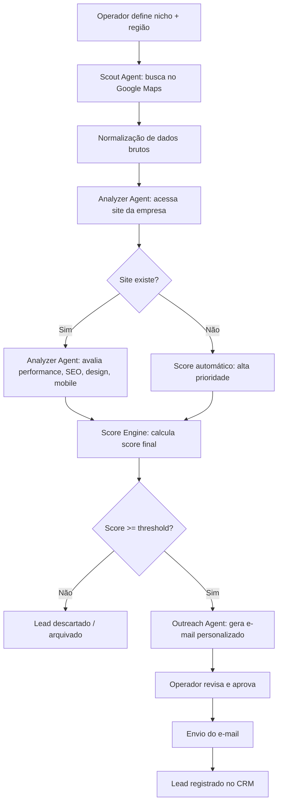

### 5.3 Fluxo — UC-07 (Follow-up, fase V1)

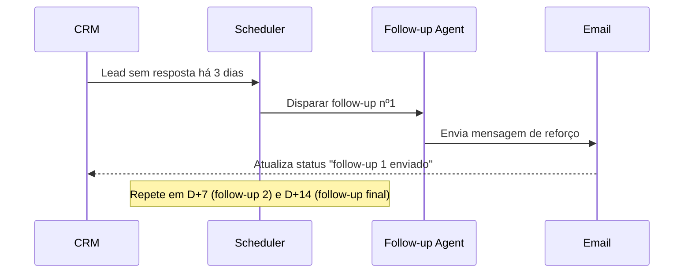

---

## 6. Requisitos Funcionais

| ID | Requisito | Descrição |
|---|---|---|
| RF-01 | Coleta de empresas | O sistema deve coletar empresas via Google Maps API a partir de nicho + região configurados. |
| RF-02 | Deduplicação | O sistema deve identificar e descartar empresas já coletadas anteriormente (por CNPJ, telefone ou domínio). |
| RF-03 | Análise de site | O sistema deve analisar o site da empresa (quando existir) quanto a performance, SEO on-page, responsividade mobile e idade estimada do design. |
| RF-04 | Análise de redes sociais | O sistema deve verificar presença e atividade recente em Instagram/Facebook (opcional na V1, obrigatório na V2). |
| RF-05 | Cálculo de score | O sistema deve calcular um score de 0 a 100 combinando os critérios da Seção 17. |
| RF-06 | Geração de e-mail | O sistema deve gerar um e-mail de contato personalizado usando os dados coletados do lead. |
| RF-07 | Revisão humana (MVP) | O sistema deve permitir aprovação manual de cada e-mail antes do envio. |
| RF-08 | Registro em CRM | Todo lead processado deve ser persistido com status rastreável (novo, qualificado, contatado, respondido, convertido, perdido). |
| RF-09 | Geração de landing page (V1) | O sistema deve gerar uma landing page de proposta personalizada por lead de alto score. |
| RF-10 | Sequência de follow-up (V1) | O sistema deve disparar follow-ups automáticos em D+3, D+7 e D+14 caso não haja resposta. |
| RF-11 | Dashboard de métricas | O sistema deve expor métricas de funil (coletados, qualificados, contatados, respondidos, convertidos). |
| RF-12 | Configuração de pesos de score | O operador deve poder ajustar os pesos dos critérios de score sem alterar código. |

---

## 7. Requisitos Não Funcionais

| Categoria | Requisito |
|---|---|
| **Performance** | Análise de um site individual deve completar em ≤ 15s (timeout configurável). Pipeline completo para 200 leads deve rodar em ≤ 2h em modo batch assíncrono. |
| **Escalabilidade** | Arquitetura deve suportar paralelização horizontal dos workers (Celery) sem alteração de código de negócio. |
| **Segurança** | Segredos (API keys) nunca em código-fonte; uso obrigatório de variáveis de ambiente / secret manager. |
| **Disponibilidade** | MVP: sem SLA formal (uso interno). SaaS (V2+): 99% uptime para API pública. |
| **Manutenibilidade** | Código organizado por Bounded Context (DDD), com testes automatizados cobrindo o Score Engine (crítico para o negócio). |
| **Testabilidade** | Cada agente deve ser testável isoladamente com mocks de LLM e de ferramentas externas. |
| **Observabilidade** | Todo agente deve emitir logs estruturados (JSON) com trace_id correlacionando o pipeline inteiro de um lead. |
| **Custos** | Custo de IA por lead deve ser monitorado e ter teto configurável (circuit breaker de orçamento diário). |

---

## 8. Arquitetura Geral (C4 Model)

### 8.1 Nível 1 — Context Diagram

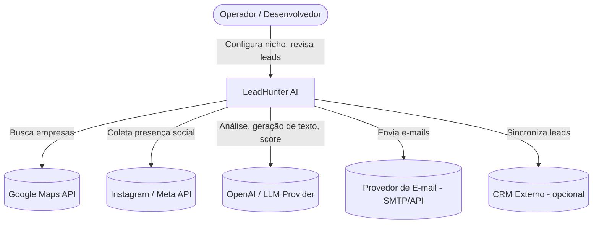

### 8.2 Nível 2 — Container Diagram

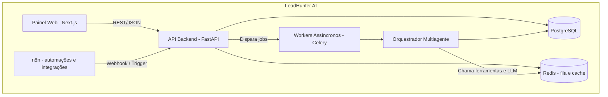

### 8.3 Nível 3 — Component Diagram (Orquestrador Multiagente)

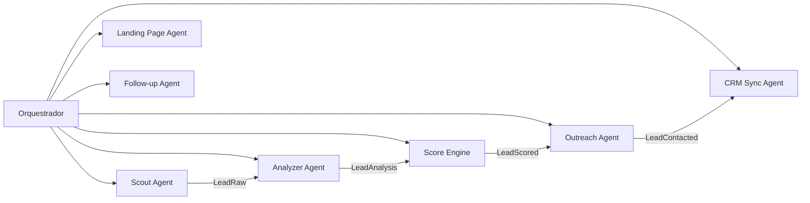

### 8.4 Nível 4 — Deployment Diagram

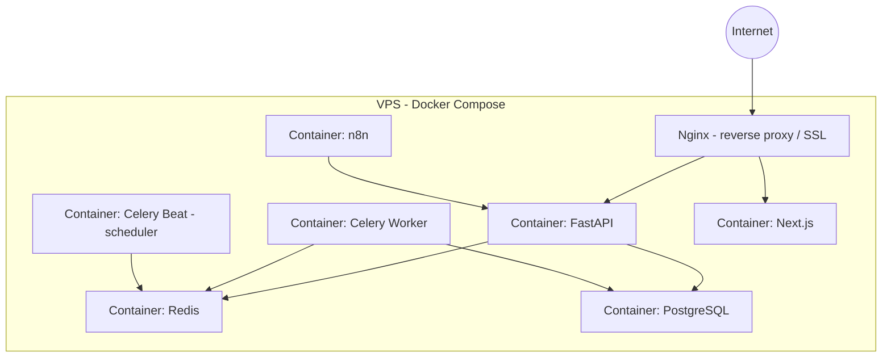

### 8.5 Justificativa Arquitetural
A escolha por **monólito modular com workers assíncronos** (em vez de microsserviços desde o início) segue o princípio "Receita antes da Plataforma" (Seção 0): reduz complexidade operacional na fase de validação, mantendo fronteiras internas claras (Bounded Contexts, Seção 12) que permitem extração futura para microsserviços quando o SaaS exigir escala multiusuário real. Ver ADR-002 (Seção 27).

---

## 9. Arquitetura Multiagente

Cada agente é um componente independente, com contrato de entrada/saída tipado (Pydantic), testável isoladamente e substituível sem afetar os demais.

### 9.1 Scout Agent
- **Responsabilidade:** buscar empresas candidatas em uma região/nicho via Google Maps Places API.
- **Objetivo:** maximizar cobertura de empresas relevantes minimizando ruído (empresas fora do ICP).
- **Entradas:** `{ niche: str, region: str, radius_km: float, max_results: int }`
- **Saídas:** lista de `LeadRaw { name, address, phone, category, place_id, website?, rating, review_count }`
- **Ferramentas:** Google Places API (Text Search + Place Details).
- **Memória:** nenhuma memória de longo prazo; usa cache Redis de 24h para evitar buscas duplicadas no mesmo dia.
- **Modelo:** não usa LLM (chamada determinística de API); opcionalmente usa LLM para normalizar categoria de negócio quando ambígua.
- **Limitações:** limite de cota da Google Places API; resultados limitados a 60 por busca (paginação).
- **Critérios de sucesso:** ≥ 95% dos resultados pertencem à categoria de nicho solicitada.

### 9.2 Analyzer Agent
- **Responsabilidade:** avaliar a maturidade digital do site (quando existente) de cada `LeadRaw`.
- **Objetivo:** produzir sinais objetivos (performance, SEO on-page, responsividade, idade do design) que alimentam o Score Engine.
- **Entradas:** `LeadRaw` (especificamente `website`).
- **Saídas:** `LeadAnalysis { has_website: bool, load_time_ms, mobile_friendly: bool, has_ssl: bool, seo_title_present, seo_meta_description_present, tech_stack_guess, last_design_update_estimate, screenshot_url }`
- **Ferramentas:** requisição HTTP + parsing HTML, Lighthouse/PageSpeed API, heurísticas de análise de HTML/CSS.
- **Memória:** cache de análise por domínio (30 dias) para evitar reprocessamento.
- **Modelo:** LLM usado apenas para classificar visualmente o "estilo de design" a partir de screenshot (visão multimodal), não para os sinais técnicos objetivos.
- **Limitações:** sites que bloqueiam scraping/bots podem gerar falso negativo; timeout de 15s por site.
- **Critérios de sucesso:** taxa de erro/timeout < 10% do total processado.

### 9.3 Score Engine
- **Responsabilidade:** consolidar sinais do Analyzer Agent em um score de 0–100 (ver Seção 17).
- **Objetivo:** priorizar leads objetivamente e de forma explicável.
- **Entradas:** `LeadAnalysis` + pesos configuráveis.
- **Saídas:** `LeadScored { score: int, breakdown: dict, priority_tier: enum }`
- **Ferramentas:** nenhuma externa — lógica determinística pura (não é um agente de IA, é um serviço de domínio).
- **Modelo:** não utiliza LLM (decisão deliberada — ver ADR-004, Seção 27, para manter o score auditável e reprodutível).
- **Critérios de sucesso:** mesmo input sempre produz mesmo score (determinismo).

### 9.4 Outreach Agent
- **Responsabilidade:** redigir e-mail de contato personalizado por lead qualificado.
- **Objetivo:** gerar mensagens que soem genuinamente personalizadas (não templates genéricos), citando problemas específicos identificados na análise.
- **Entradas:** `LeadScored` + `LeadAnalysis` + perfil do operador (tom de voz, portfólio, oferta).
- **Saídas:** `OutreachMessage { subject, body, personalization_points: list[str] }`
- **Ferramentas:** LLM (geração de texto).
- **Memória:** exemplos de e-mails de sucesso anteriores (few-shot dinâmico, via Base de Conhecimento — Seção 19).
- **Modelo:** LLM de linguagem natural com boa capacidade de escrita em português (ex.: modelo de propósito geral configurado com temperatura moderada para variação sem perda de coerência).
- **Limitações:** deve evitar alegações falsas sobre o site do lead; deve ser revisado por humano no MVP.
- **Critérios de sucesso:** taxa de resposta ≥ 8% (KPI de negócio, Seção 3.4).

### 9.5 Landing Page Agent (V1)
- **Responsabilidade:** gerar uma landing page de proposta comercial personalizada para o lead.
- **Entradas:** `LeadScored`, `LeadAnalysis`, dados do operador (portfólio, cases, preços-base).
- **Saídas:** HTML/página publicável com URL única por lead.
- **Ferramentas:** LLM (geração de copy) + template engine (geração de HTML).
- **Critérios de sucesso:** tempo de geração ≤ 60s por landing page.

### 9.6 Follow-up Agent (V1)
- **Responsabilidade:** gerenciar sequência de reengajamento para leads contatados sem resposta.
- **Entradas:** `Lead` com status "contatado" e `days_since_contact`.
- **Saídas:** `OutreachMessage` variando o ângulo da mensagem (reforço, prova social, urgência leve).
- **Ferramentas:** LLM + Scheduler (Celery Beat).
- **Critérios de sucesso:** cada follow-up deve ser distinto do anterior (evitar repetição perceptível).

### 9.7 CRM Sync Agent (V1)
- **Responsabilidade:** sincronizar o estado do lead com sistema de CRM (interno ou externo).
- **Entradas:** eventos de mudança de status do `Lead`.
- **Saídas:** registro atualizado no CRM.
- **Ferramentas:** API do CRM externo (Notion/Airtable) ou tabela interna `crm_records`.
- **Critérios de sucesso:** consistência eventual ≤ 5 minutos entre estado interno e CRM.

---

## 10. Pipeline

### 10.1 Visão Geral do Pipeline

```
Internet
  ↓
Coleta (Scout Agent — Google Maps)
  ↓
Normalização (dedupe, padronização de campos)
  ↓
Análise (Analyzer Agent — site, SEO, design, mobile)
  ↓
Score (Score Engine — 0–100)
  ↓
Contato (Outreach Agent — e-mail personalizado + revisão humana)
  ↓
Proposta (Landing Page Agent — V1)
  ↓
Email (envio via provedor SMTP/API)
  ↓
Follow-up (Follow-up Agent — D+3, D+7, D+14)
  ↓
CRM (CRM Sync Agent — status final: convertido/perdido)
```

### 10.2 Execução Técnica do Pipeline

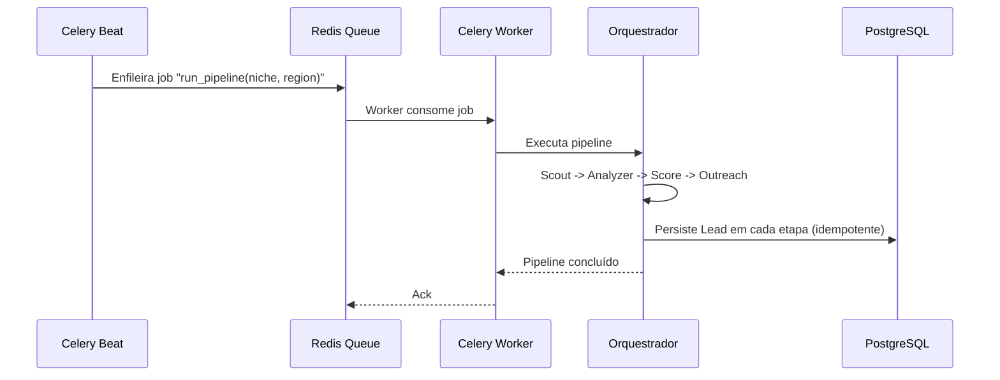

Cada etapa do pipeline persiste seu resultado no banco (Seção 11) antes de acionar a próxima, garantindo **idempotência** e possibilitando **retomada em caso de falha** sem reprocessar etapas já concluídas.

---

## 11. Banco de Dados

### 11.1 Modelo Relacional (visão lógica)

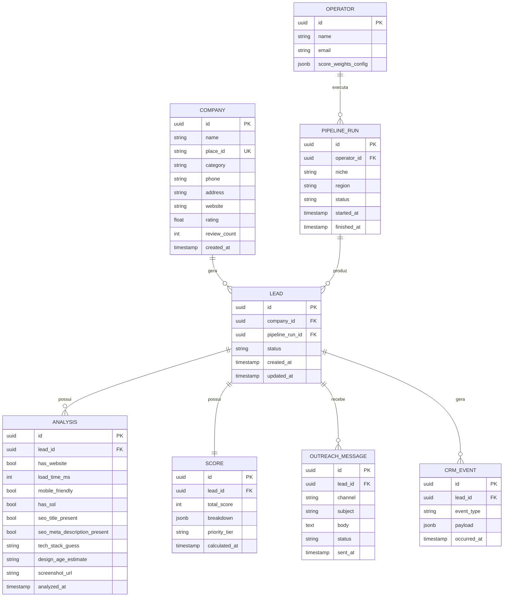

### 11.2 Índices e Restrições
- `company.place_id` — **UNIQUE** (chave de deduplicação primária vinda do Google Maps).
- `company.phone` — índice para deduplicação secundária.
- `lead.status` — índice (consultas frequentes por status no dashboard).
- `score.total_score` — índice (ordenação para priorização).
- `analysis.lead_id` — **UNIQUE** (uma análise ativa por lead; histórico via tabela de auditoria, se necessário).

### 11.3 Estratégias
- **Particionamento futuro:** tabela `crm_event` particionada por mês quando o volume justificar (V2+).
- **Soft delete:** nenhuma tabela usa delete físico; status `archived` é usado para leads descartados, preservando dados para treinamento futuro de modelos internos.
- **Migrations:** Alembic, versionado junto ao código (nunca alteração manual de schema em produção).

---

## 12. Modelo de Domínio (DDD)

### 12.1 Bounded Contexts
| Bounded Context | Responsabilidade |
|---|---|
| **Prospecting** | Coleta e normalização de empresas (Scout). |
| **Digital Assessment** | Análise de maturidade digital (Analyzer, Score Engine). |
| **Outreach** | Geração e envio de mensagens de contato e follow-up. |
| **Relationship Management** | Sincronização com CRM e ciclo de vida do lead pós-contato. |
| **Operator Configuration** | Configuração de nicho, região, pesos de score, tom de voz. |

### 12.2 Entidades e Agregados
- **Aggregate Root: `Lead`**
  - Entities: `Company` (referência), `Analysis`, `Score`, `OutreachMessage[]`, `CrmEvent[]`
  - Invariantes: um `Lead` só pode transicionar de status seguindo a máquina de estados (Seção 12.5); um `Score` só pode ser calculado após `Analysis` existir.
- **Aggregate Root: `PipelineRun`**
  - Entities: `Lead[]` produzidos na execução.
  - Invariantes: um `PipelineRun` é imutável após `finished_at` ser setado.

### 12.3 Value Objects
- `ScoreBreakdown` (imutável — dict de critério → pontuação).
- `Address` (rua, cidade, estado, CEP — comparação por igualdade estrutural).
- `ContactChannel` (email | whatsapp | instagram_dm).

### 12.4 Repositories
- `LeadRepository`, `CompanyRepository`, `PipelineRunRepository`, `OperatorRepository` — interfaces na camada de domínio, implementações concretas (PostgreSQL/SQLAlchemy) na camada de infraestrutura (Clean Architecture — dependências apontam para dentro).

### 12.5 Services de Domínio
- `ScoreCalculationService` — pura lógica de negócio determinística, sem I/O.
- `LeadDeduplicationService` — decide se um `Company` recém-coletado já existe.
- `LeadStatusTransitionService` — valida transições permitidas da máquina de estados.

### 12.6 Factories
- `LeadFactory.from_raw_scout_result(...)` — constrói um `Lead` + `Company` a partir da saída bruta do Scout Agent.

### 12.7 Policies
- `MinimumScoreToContactPolicy` — define o score mínimo (padrão: 70) para um lead avançar a Outreach.
- `MaxDailyEmailPolicy` — limite diário de e-mails enviados por operador (proteção contra spam/reputação de domínio).

### 12.8 Domain Events
- `LeadCollected`, `LeadAnalyzed`, `LeadScored`, `LeadContacted`, `LeadResponded`, `LeadConverted`, `LeadLost`, `LeadArchived`.

### 12.9 Máquina de Estados do Lead

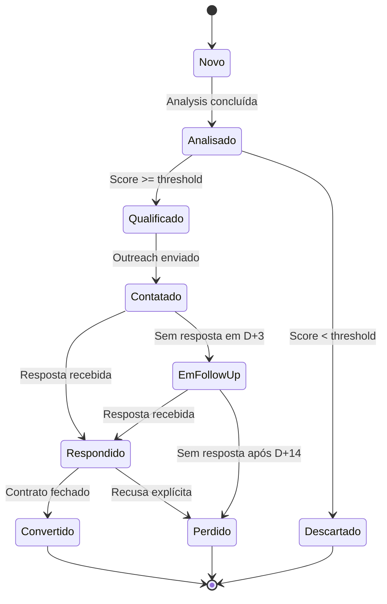

---

## 13. Event Storming

### 13.1 Eventos de Domínio (linha do tempo)
`LeadCollected` → `LeadDeduplicated` → `LeadAnalyzed` → `LeadScored` → `LeadQualified` / `LeadDiscarded` → `OutreachDrafted` → `OutreachApproved` (ator humano) → `EmailSent` → `FollowUpScheduled` → `ResponseReceived` / `FollowUpExhausted` → `LeadConverted` / `LeadLost`.

### 13.2 Comandos
`CollectLeads(niche, region)`, `AnalyzeLead(lead_id)`, `CalculateScore(lead_id)`, `DraftOutreach(lead_id)`, `ApproveOutreach(lead_id, operator_id)`, `SendEmail(message_id)`, `ScheduleFollowUp(lead_id)`, `RecordResponse(lead_id, content)`, `MarkConverted(lead_id)`.

### 13.3 Atores
- **Operador** (humano): aprova outreach, ajusta pesos, marca conversão.
- **Sistema/Agentes** (automatizado): todas as demais transições.
- **Lead** (externo): dispara `ResponseReceived` ao responder e-mail.

### 13.4 Regras de Negócio Identificadas
- Nenhum e-mail é enviado sem `OutreachApproved` na fase MVP (revisão humana obrigatória).
- Um lead nunca recebe mais de 3 follow-ups automáticos.
- Um `Score` recalculado invalida o `priority_tier` anterior (recalcula em cascata).

---

## 14. APIs

### 14.1 Convenções Gerais
- Base URL: `https://api.leadhunter.ai/v1`
- Autenticação: Bearer Token (JWT) — obrigatório em todos os endpoints exceto `/health`.
- Formato: JSON. Erros seguem RFC 7807 (`application/problem+json`).

### 14.2 Endpoints Principais

**`POST /pipeline-runs`** — Inicia uma nova execução do pipeline.
```json
// Request
{ "niche": "clínicas odontológicas", "region": "Belo Horizonte, MG", "max_results": 200 }

// Response 202 Accepted
{ "id": "b1e2...", "status": "queued", "created_at": "2026-07-01T10:00:00Z" }
```

**`GET /pipeline-runs/{id}`** — Consulta status de uma execução.
```json
{ "id": "b1e2...", "status": "running", "leads_collected": 87, "leads_qualified": 21 }
```

**`GET /leads`** — Lista leads com filtros.
```
GET /leads?status=qualificado&min_score=80&region=Belo+Horizonte
```
```json
{
  "data": [
    { "id": "a91f...", "company_name": "Studio Odonto BH", "score": 84, "status": "qualificado" }
  ],
  "page": 1, "total": 21
}
```

**`GET /leads/{id}`** — Detalhe completo de um lead (inclui `analysis`, `score.breakdown`, mensagens).

**`POST /leads/{id}/outreach/approve`** — Aprova o e-mail gerado para envio.
```json
// Request
{ "operator_id": "op_01" }
// Response 200
{ "status": "approved", "scheduled_send_at": "2026-07-01T14:00:00Z" }
```

**`PATCH /leads/{id}/status`** — Atualiza status manualmente (ex.: `convertido`, `perdido`).

**`PUT /operators/{id}/score-weights`** — Atualiza pesos de score (RF-12).
```json
{ "seo": 0.25, "performance": 0.2, "design": 0.25, "social_presence": 0.15, "no_website_bonus": 0.15 }
```

**`GET /metrics/funnel`** — Métricas agregadas do funil (Seção 23).

### 14.3 Erros Padrão
```json
{
  "type": "https://leadhunter.ai/errors/insufficient-score",
  "title": "Lead abaixo do score mínimo para outreach",
  "status": 422,
  "detail": "Score atual: 45. Mínimo requerido: 70."
}
```

---

## 15. Prompts dos Agentes

### 15.1 Analyzer Agent — Classificação Visual de Design (multimodal)
```
Você é um analista de maturidade digital especializado em avaliar sites institucionais de pequenas empresas.

Receberá um screenshot da homepage de um site. Avalie APENAS o que é visualmente observável.

Retorne SOMENTE um JSON válido, sem texto adicional, no formato:
{
  "design_age_estimate": "moderno" | "intermediario" | "datado" | "muito_datado",
  "visual_issues": ["lista curta de problemas objetivos observados"],
  "confidence": 0.0-1.0
}

Critérios de "muito_datado": uso de tabelas para layout, tipografia serifada padrão de navegador,
ausência de espaçamento consistente, imagens de baixa resolução, ausência de responsividade aparente.

Não invente informações que não sejam visíveis na imagem.
```

### 15.2 Outreach Agent — Geração de E-mail
```
Você é um redator especializado em outreach B2B para o mercado de desenvolvimento web, escrevendo em
nome de {operator_name}, um(a) {operator_role} com o seguinte diferencial: {operator_value_prop}.

Contexto do lead:
- Empresa: {company_name}
- Categoria: {company_category}
- Problemas identificados (use no MÁXIMO 2, os mais relevantes): {analysis_issues}
- Score: {score}/100

Regras obrigatórias:
1. Máximo 120 palavras no corpo do e-mail.
2. Cite UM problema específico e concreto identificado na análise (nunca genérico).
3. Nunca faça afirmações que não estejam nos dados fornecidos.
4. Tom consultivo, nunca agressivo ou de "spam de vendas".
5. Termine com uma pergunta aberta de baixo compromisso (não peça reunião diretamente).
6. Assine como {operator_name}.

Retorne em JSON: { "subject": "...", "body": "..." }
```

### 15.3 Follow-up Agent — Sequência
```
Você está escrevendo o follow-up nº {sequence_number} (1, 2 ou 3) para um lead que não respondeu ao
e-mail original enviado em {original_send_date}.

E-mail original enviado:
"""
{original_email_body}
"""

Regras:
- Follow-up 1 (D+3): tom leve, reforce o valor, não repita o mesmo argumento literalmente.
- Follow-up 2 (D+7): adicione um ângulo novo (ex.: prova social genérica, um exemplo de resultado).
- Follow-up 3 (D+14): tom de "fechamento educado", oferecendo encerrar o contato caso não haja interesse.
- Máximo 80 palavras.
- Nunca soe desesperado ou repetitivo.

Retorne em JSON: { "subject": "...", "body": "..." }
```

### 15.4 Landing Page Agent — Copy da Proposta
```
Gere o copy (não o HTML) de uma landing page de proposta comercial personalizada para {company_name}.

Seções obrigatórias, cada uma como campo JSON:
1. "headline": gancho direto relacionado ao problema identificado ({analysis_issues}).
2. "problem_statement": 2-3 frases descrevendo o cenário atual de forma factual, sem exagero.
3. "solution_pitch": como {operator_name} resolve especificamente esse problema.
4. "social_proof_placeholder": texto genérico indicando onde inserir prova social real (não invente cases).
5. "cta": chamada para ação de baixo atrito (ex.: "conversa de 15 minutos", não "feche agora").

Retorne apenas o JSON com essas 5 chaves.
```

---

## 16. Ferramentas

| Ferramenta | Papel no sistema |
|---|---|
| **Google Maps Places API** | Fonte primária de coleta de empresas (Scout Agent). |
| **Instagram/Meta Graph API** | Verificação de presença e atividade em redes sociais (V1+). |
| **OpenAI API (ou equivalente)** | Motor de LLM para Analyzer (visão), Outreach, Follow-up e Landing Page Agents. |
| **Redis** | Fila de mensagens (Celery broker), cache de deduplicação e de análises. |
| **PostgreSQL** | Banco de dados relacional primário (fonte da verdade). |
| **FastAPI** | Framework do backend/API REST. |
| **Next.js** | Painel web do operador (dashboard, revisão de leads, configuração). |
| **n8n** | Orquestração de integrações externas de baixo código (ex.: notificações, webhooks de e-mail). |
| **Celery + Celery Beat** | Execução assíncrona de jobs e agendamento (follow-ups, pipeline runs). |
| **Docker / Docker Compose** | Empacotamento e orquestração de containers para deploy em VPS. |

---

## 17. Sistema de Score

### 17.1 Filosofia
O score deve ser **determinístico, explicável e auditável** — nunca uma inferência opaca de LLM (ver ADR-004). Ele responde à pergunta: *"Quão provável é que esta empresa precise e tenha condição de contratar um serviço de desenvolvimento web agora?"*

### 17.2 Critérios e Pesos Padrão
| Critério | Peso padrão | Lógica |
|---|---|---|
| Ausência de site | 0.25 | Empresa sem site = altíssima oportunidade (bônus direto). |
| Performance do site (quando existe) | 0.20 | Site lento (>3s de load) indica baixa manutenção técnica. |
| SEO on-page | 0.20 | Ausência de title/meta description = maturidade digital baixa. |
| Design/idade visual | 0.20 | Sites classificados como "datado"/"muito_datado" pelo Analyzer. |
| Presença em redes sociais | 0.15 | Empresa ativa em redes, mas sem site = sinal de orçamento existente + oportunidade clara. |

### 17.3 Fórmula
```
score = Σ (peso_critério × pontuação_critério_normalizada_0_a_100)
```
Cada critério é normalizado individualmente para 0–100 antes da ponderação. O resultado final também é 0–100.

### 17.4 Priority Tiers
| Score | Tier | Ação |
|---|---|---|
| 85–100 | `hot` | Outreach imediato, prioridade máxima de revisão humana. |
| 70–84 | `warm` | Outreach padrão. |
| 50–69 | `cold` | Arquivado para campanha futura (ex.: newsletter de nutrição). |
| < 50 | `discard` | Descartado — provavelmente já possui boa maturidade digital. |

### 17.5 Exemplo de Breakdown
```json
{
  "total_score": 82,
  "breakdown": {
    "no_website": { "raw": 100, "weight": 0.25, "weighted": 25.0 },
    "performance": { "raw": 60, "weight": 0.20, "weighted": 12.0 },
    "seo": { "raw": 70, "weight": 0.20, "weighted": 14.0 },
    "design": { "raw": 80, "weight": 0.20, "weighted": 16.0 },
    "social_presence": { "raw": 100, "weight": 0.15, "weighted": 15.0 }
  },
  "priority_tier": "hot"
}
```

---

## 18. Estratégia de IA

### 18.1 Modelos
- **Geração de texto (Outreach, Follow-up, Landing Page):** modelo de propósito geral com forte capacidade em português brasileiro, priorizando naturalidade e aderência a instruções de formato (JSON estruturado).
- **Visão (classificação de design):** modelo multimodal capaz de processar screenshot + texto.
- **Score:** **não usa LLM** — lógica de domínio pura (Seção 17), por decisão arquitetural (ADR-004).

### 18.2 Custos
- Cada chamada de LLM é logada com tokens de entrada/saída e custo estimado, associada ao `lead_id` e `pipeline_run_id`, permitindo cálculo do KPI "custo por lead qualificado" (Seção 3.4).
- **Circuit breaker de orçamento:** se o custo diário de IA ultrapassar um teto configurado, novas execuções de pipeline são pausadas automaticamente até revisão do operador.

### 18.3 Fallback
- Se o provedor primário de LLM falhar (timeout/erro 5xx), o sistema tenta um provedor secundário configurado (estratégia de *fallback chain*).
- Se ambos falharem, o `Lead` permanece em status intermediário (`analise_pendente`) para reprocessamento posterior — nunca falha silenciosamente.

### 18.4 Prompt Engineering
- Todos os prompts de agentes exigem **saída estritamente em JSON**, validada por schema Pydantic após o retorno do modelo (rejeição e nova tentativa em caso de JSON inválido, até 2 retries).
- Prompts incluem exemplos negativos explícitos (o que NÃO fazer) quando aplicável, especialmente no Outreach Agent (evitar alegações falsas).

### 18.5 Tool Calling
- Na V1+, o Outreach Agent poderá usar tool calling para consultar a Base de Conhecimento (Seção 19) e recuperar exemplos de e-mails de alta conversão antes de redigir a mensagem (RAG, ver 18.6).

### 18.6 RAG (Retrieval-Augmented Generation)
- Base de exemplos de e-mails bem-sucedidos (que geraram resposta) é indexada por embeddings e usada como few-shot dinâmico para o Outreach Agent, aumentando a taxa de resposta ao longo do tempo.

### 18.7 Memória
- **Memória de curto prazo:** contexto de uma única execução do agente (sem persistência).
- **Memória de longo prazo:** Base de Conhecimento (Seção 19), consultada via RAG.
- Nenhum agente mantém estado conversacional entre execuções — cada chamada é stateless por design, garantindo reprodutibilidade.

---

## 19. Base de Conhecimento

### 19.1 Organização
- **Exemplos de outreach bem-sucedido:** e-mails que geraram resposta positiva, indexados com metadados (nicho, problema citado, tier de score).
- **Padrões de análise de sites:** heurísticas validadas manualmente que melhoram a precisão do Analyzer Agent ao longo do tempo.
- **Objeções comuns:** respostas de leads que recusaram, categorizadas para ajustar futuros prompts de Outreach/Follow-up.

### 19.2 Uso
- Consultada via RAG pelo Outreach Agent e Follow-up Agent para melhorar personalização (Seção 18.6).
- Consultada por relatórios internos para identificar quais critérios de score realmente correlacionam com conversão (feedback loop entre Score Engine e resultados reais).

### 19.3 Indexação
- Armazenamento vetorial (ex.: pgvector como extensão do PostgreSQL já utilizado, evitando dependência de infraestrutura adicional na fase MVP).
- Reindexação incremental a cada novo `LeadConverted` ou `LeadResponded` com feedback positivo.

---

## 20. Knowledge Graph

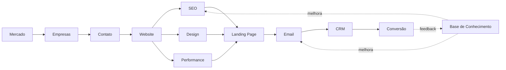

O grafo evidencia o **loop de feedback central do sistema**: toda conversão (ou perda) retroalimenta a Base de Conhecimento, que por sua vez melhora a qualidade dos e-mails e a precisão dos critérios de score futuros.

---

## 21. Ontologia

### 21.1 Entidades Conceituais
- **Company** — pessoa jurídica identificada externamente (Google Maps), independente de já ter sido processada pelo sistema.
- **Lead** — representação interna do processo de prospecção de uma `Company`; possui ciclo de vida próprio (Seção 12.9).
- **Analysis** — conjunto de sinais objetivos de maturidade digital coletados sobre o site de um `Lead`.
- **Score** — avaliação numérica derivada de uma `Analysis`, segundo pesos configuráveis.
- **OutreachMessage** — artefato de comunicação (e-mail/mensagem) gerado para um `Lead`.
- **PipelineRun** — execução em lote do pipeline completo, delimitada no tempo.
- **Operator** — usuário humano responsável por configurar e supervisionar o sistema.

### 21.2 Relacionamentos Semânticos
`Company` **é prospectada como** `Lead` → `Lead` **é avaliado por** `Analysis` → `Analysis` **gera** `Score` → `Score` **qualifica para** `OutreachMessage` → `OutreachMessage` **pertence a** `PipelineRun`.

### 21.3 Vocabulário Oficial (glossário reduzido de domínio — ver Seção 29 para o completo)
- **Maturidade digital**: grau em que uma empresa possui presença online funcional, atualizada e otimizada.
- **Score de qualificação**: pontuação 0–100 que representa a prioridade de contato de um lead.
- **Outreach**: primeiro contato comercial proativo com um lead.

---

## 22. Segurança

### 22.1 LGPD
- Dados coletados (nome da empresa, telefone, endereço, website) são **dados públicos de pessoa jurídica**, o que reduz o risco sob a LGPD, mas o sistema deve:
  - Manter registro da origem e finalidade da coleta (Google Maps, para fins de prospecção B2B).
  - Oferecer opt-out: qualquer empresa que solicite remoção deve ser marcada como `blacklisted` e nunca mais reprocessada.
  - Não coletar dados de pessoas físicas vinculadas às empresas além do estritamente necessário (ex.: e-mail de contato institucional, não pessoal, quando possível).

### 22.2 Spam
- Respeito a limites de envio diário por domínio (`MaxDailyEmailPolicy`, Seção 12.7) para preservar reputação de e-mail (evitar blacklisting em provedores).
- Uso de autenticação de domínio (SPF, DKIM, DMARC) obrigatório antes de qualquer envio em produção.
- Link de descadastro obrigatório em toda sequência de follow-up.

### 22.3 Rate Limit
- Rate limiting na API pública (V2+) por operador/token, para prevenir abuso.
- Rate limiting nas chamadas a APIs externas (Google Maps, LLM) respeitando cotas contratadas.

### 22.4 Autenticação e Autorização
- MVP: autenticação simples (single operator, token estático em variável de ambiente).
- SaaS (V2+): JWT com escopos por `operator_id`, isolamento multi-tenant a nível de query (todas as queries filtradas por `operator_id`).

### 22.5 Auditoria e Logs
- Toda ação de mutação de estado (`ApproveOutreach`, `MarkConverted`, alteração de pesos de score) é registrada em tabela de auditoria com `actor`, `timestamp`, `before/after`.

---

## 23. Observabilidade

### 23.1 Logs
- Formato estruturado JSON, com `trace_id` propagado por todo o pipeline (correlacionando Scout → Analyzer → Score → Outreach de um mesmo lead).

### 23.2 Tracing
- Instrumentação via OpenTelemetry nos pontos de chamada a serviços externos (Google Maps, LLM, provedor de e-mail) para medir latência e taxa de erro por dependência.

### 23.3 Métricas
- Funil completo (coletados → analisados → qualificados → contatados → respondidos → convertidos), exposto via `GET /metrics/funnel`.
- Custo de IA por etapa e por lead.
- Latência p50/p95 de cada agente.

### 23.4 Alertas
- Alerta se taxa de erro do Analyzer Agent > 15% em uma execução.
- Alerta se custo diário de IA atingir 80% do teto configurado (Seção 18.2).
- Alerta se nenhum lead for coletado em uma execução (possível falha silenciosa na API do Google Maps).

### 23.5 Health Checks
- `GET /health` — verifica conectividade com PostgreSQL, Redis e disponibilidade do provedor de LLM primário.

---

## 24. Deploy

### 24.1 Estratégia
Deploy inicial em **VPS único** via Docker Compose (custo baixo, adequado à fase de validação de receita). Migração para orquestração mais robusta (Kubernetes) só é justificada em escala SaaS multiusuário real (ver Roadmap, Seção 25).

### 24.2 Componentes do `docker-compose.yml`
- `nginx` (reverse proxy + terminação SSL via Let's Encrypt/Certbot).
- `api` (FastAPI).
- `worker` (Celery worker).
- `beat` (Celery beat — agendamento de follow-ups e pipeline runs recorrentes).
- `postgres` (com volume persistente).
- `redis`.
- `frontend` (Next.js, build de produção).
- `n8n`.

### 24.3 CI/CD (GitHub Actions)
1. **Pull Request:** lint + testes automatizados (pytest para backend, cobrindo obrigatoriamente o `ScoreCalculationService`).
2. **Merge em `main`:** build das imagens Docker, push para registry, deploy via SSH + `docker compose pull && docker compose up -d` na VPS.

### 24.4 Backup
- Backup diário automatizado do PostgreSQL (`pg_dump`) para armazenamento externo (ex.: bucket S3-compatible), retenção de 30 dias.

### 24.5 SSL
- Certificados gerenciados via Certbot com renovação automática, terminação no Nginx.

---

## 25. Roadmap

| Fase | Escopo | Duração estimada |
|---|---|---|
| **MVP** | Pipeline completo (coleta → análise → score → outreach com revisão humana) para um único operador. | 0–3 meses |
| **V1** | Follow-up automatizado, Landing Page Agent, integração CRM leve, dashboard de métricas. | 3–9 meses |
| **V2** | Multiusuário (multi-tenant), configuração de pesos de score por usuário, painel self-service. | 9–14 meses |
| **V3 / SaaS** | Cobrança por assinatura, onboarding self-service, múltiplos nichos simultâneos por usuário. | 14–18 meses |
| **Marketplace (exploratório)** | Marketplace de "playbooks de nicho" (configurações de score e prompts otimizados por vertical, ex.: odontologia, advocacia, estética). | 18+ meses |

---

## 26. Backlog (priorizado)

1. **[Crítico]** Implementar Scout Agent + integração Google Maps Places API.
2. **[Crítico]** Implementar Analyzer Agent (performance + SEO on-page, sem visão ainda).
3. **[Crítico]** Implementar Score Engine determinístico com pesos configuráveis.
4. **[Crítico]** Implementar Outreach Agent com fluxo de aprovação humana.
5. **[Alta]** Dashboard básico (Next.js) para revisão de leads.
6. **[Alta]** Análise visual via LLM multimodal (classificação de design).
7. **[Média]** Follow-up Agent + Celery Beat scheduling.
8. **[Média]** Landing Page Agent.
9. **[Média]** Integração CRM (Notion/Airtable) via CRM Sync Agent.
10. **[Baixa]** RAG sobre Base de Conhecimento para few-shot dinâmico.
11. **[Baixa]** Multi-tenancy e autenticação JWT por operador (início da fase SaaS).

---

## 27. Architecture Decision Records (ADR)

### ADR-001 — Uso do FastAPI como framework de backend
- **Status:** Aceito
- **Contexto:** necessidade de uma API assíncrona, com validação de dados forte (Pydantic) e boa integração com workers Celery e com a stack Python usada pelos agentes de IA.
- **Decisão:** adotar FastAPI.
- **Consequências:** ganho de produtividade (tipagem, OpenAPI automático); ecossistema Python já alinhado com bibliotecas de IA (OpenAI SDK, etc.).
- **Alternativas consideradas:** Django (rejeitado — overhead desnecessário para API-first); Node/Express (rejeitado — fragmentaria a stack entre Python (agentes) e JS (backend), aumentando custo cognitivo).

### ADR-002 — Monólito modular em vez de microsserviços na fase inicial
- **Status:** Aceito
- **Contexto:** projeto em fase de validação de receita (um único operador), sem necessidade real de escala distribuída.
- **Decisão:** construir um monólito modular com Bounded Contexts bem definidos (Seção 12), preparado para extração futura.
- **Consequências:** menor complexidade operacional agora; risco de acoplamento futuro se as fronteiras de módulo não forem respeitadas disciplinadamente.
- **Alternativas consideradas:** microsserviços desde o início (rejeitado — complexidade prematura, viola o princípio "Receita antes da Plataforma").

### ADR-003 — PostgreSQL como banco de dados primário
- **Status:** Aceito
- **Contexto:** necessidade de consistência transacional forte para o funil de leads e suporte nativo a JSON (`jsonb`) para dados semiestruturados (breakdown de score, payloads de eventos CRM).
- **Decisão:** PostgreSQL.
- **Consequências:** suporte futuro a `pgvector` para RAG (Seção 19) sem adicionar nova peça de infraestrutura.
- **Alternativas consideradas:** MongoDB (rejeitado — o domínio é fundamentalmente relacional, com integridade referencial importante entre Lead/Company/Score).

### ADR-004 — Score Engine determinístico (sem LLM)
- **Status:** Aceito
- **Contexto:** o score é a decisão de negócio mais crítica do sistema (determina quem recebe outreach); precisa ser explicável e reprodutível.
- **Decisão:** implementar o cálculo de score como lógica de domínio pura, sem chamada a LLM.
- **Consequências:** total auditabilidade e testabilidade; exige que sinais de entrada (Analysis) sejam de boa qualidade, já que o score não "compensa" ruído com julgamento qualitativo.
- **Alternativas consideradas:** score gerado por LLM a partir dos dados brutos (rejeitado — não determinístico, difícil de testar e de explicar ao operador).

### ADR-005 — Revisão humana obrigatória de outreach no MVP
- **Status:** Aceito
- **Contexto:** risco reputacional e de qualidade ao enviar e-mails gerados por IA sem supervisão, especialmente na fase de validação.
- **Decisão:** todo e-mail gerado passa por aprovação humana antes do envio até que a taxa de qualidade seja validada (critério de saída: ≥ 95% de aprovação sem edição por 4 semanas consecutivas).
- **Consequências:** menor velocidade inicial, maior confiança na qualidade; caminho claro para automação total pós-validação.

---

## 28. Convenções

### 28.1 Código
- Python: PEP 8, type hints obrigatórios em toda função pública, `ruff` para lint.
- Nomes de classes de domínio em PascalCase alinhados à Ontologia (Seção 21) — nunca abreviar (`Lead`, não `Ld`).

### 28.2 Commits
- Conventional Commits: `feat:`, `fix:`, `refactor:`, `docs:`, `test:`, `chore:`.
- Exemplo: `feat(scout-agent): adiciona paginação de resultados do Google Places`.

### 28.3 Branches
- `main` (produção), `develop` (integração), `feature/<nome-curto>`, `fix/<nome-curto>`.

### 28.4 Nomenclatura
- Tabelas do banco: `snake_case`, singular (`lead`, não `leads`).
- Endpoints REST: plural (`/leads`, `/pipeline-runs`).
- Eventos de domínio: `PascalCase` no passado (`LeadScored`, não `ScoreLead`).

### 28.5 Documentação
- Toda mudança estrutural relevante (novo agente, nova entidade, nova decisão arquitetural) deve gerar atualização deste `MASTER_CONTEXT.md`, incluindo, se aplicável, um novo ADR (Seção 27).

### 28.6 Estrutura de Pastas (proposta)
```
/app
  /domain          # entidades, value objects, services de domínio, eventos
  /agents          # Scout, Analyzer, Outreach, FollowUp, LandingPage, CRMSync
  /infrastructure  # repositories concretos, clientes de API externa (Google Maps, LLM)
  /api             # rotas FastAPI, schemas Pydantic de I/O
  /workers         # tasks Celery
  /config          # settings, pesos padrão de score
/tests
  /unit
  /integration
/frontend          # Next.js
/n8n               # workflows exportados
```

---

## 29. Glossário

| Termo | Definição |
|---|---|
| **Lead** | Representação interna de uma empresa em processo de prospecção, com ciclo de vida próprio. |
| **Score** | Pontuação 0–100 que mede a probabilidade de conversão de um lead. |
| **Maturidade digital** | Grau de qualidade e atualidade da presença online de uma empresa. |
| **Outreach** | Primeiro contato comercial proativo. |
| **Follow-up** | Mensagem de reengajamento enviada após ausência de resposta ao contato inicial. |
| **Pipeline Run** | Execução em lote do fluxo completo de prospecção para um nicho/região. |
| **Bounded Context** | Fronteira de modelo de domínio dentro da qual termos têm significado único e consistente (DDD). |
| **ICP** | Ideal Customer Profile — perfil de cliente ideal. |
| **Priority Tier** | Categoria derivada do score (`hot`, `warm`, `cold`, `discard`). |
| **RAG** | Retrieval-Augmented Generation — técnica de recuperar conhecimento externo para enriquecer a geração de texto por LLM. |
| **Agente** | Componente autônomo especializado, com entrada/saída definidas, que executa uma etapa do pipeline usando ferramentas e/ou LLM. |

---

## 30. Apêndices

### 30.1 Diagrama Consolidado do Sistema

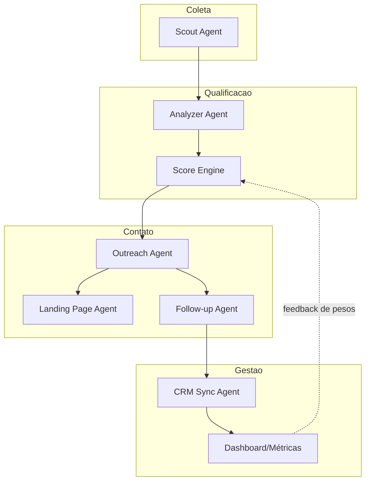

### 30.2 Tabela-Resumo de Todos os Agentes
| Agente | Usa LLM? | Determinístico? | Fase |
|---|---|---|---|
| Scout Agent | Não (opcional para normalização) | Sim | MVP |
| Analyzer Agent | Sim (visão, parcial) | Parcial | MVP |
| Score Engine | Não | Sim | MVP |
| Outreach Agent | Sim | Não | MVP |
| Landing Page Agent | Sim | Não | V1 |
| Follow-up Agent | Sim | Não | V1 |
| CRM Sync Agent | Não | Sim | V1 |

### 30.3 Referências Internas
- Requisitos Funcionais → Seção 6
- Modelo de Domínio → Seção 12
- Score → Seção 17
- Segurança/LGPD → Seção 22

---

## Revisão de Consistência

Este documento foi revisado quanto a:
- **Inconsistências:** nomenclatura de status do `Lead` unificada entre Seções 6, 11 e 12.9.
- **Duplicações:** critérios de score descritos uma única vez (Seção 17), referenciados (não repetidos) nas Seções 9.3 e 12.5.
- **Lacunas:** endpoints de configuração de pesos (RF-12) mapeados explicitamente na Seção 14.2.
- **Ambiguidades:** todo agente possui contrato de entrada/saída explícito (Seção 9), eliminando ambiguidade sobre responsabilidades.

**Fim do MASTER_CONTEXT.md**
