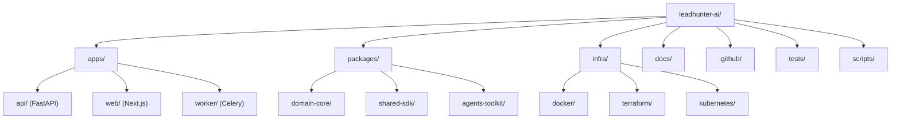
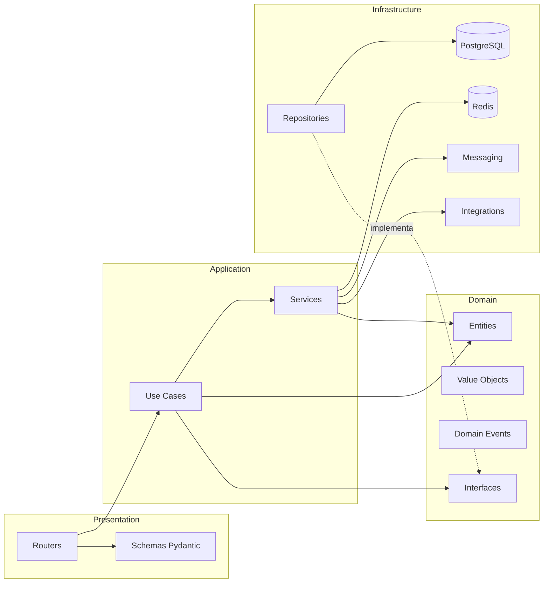
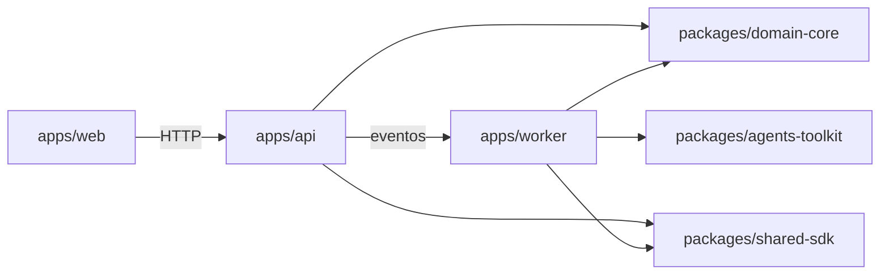
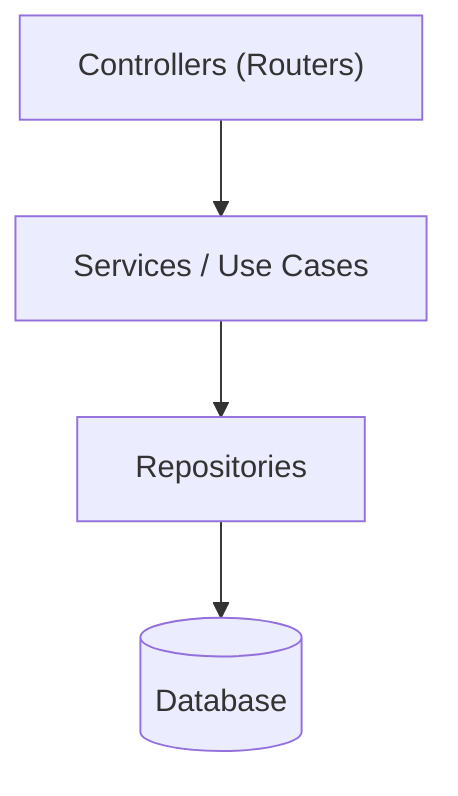
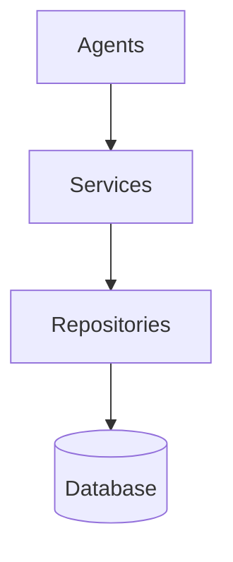

# PROJECT_STRUCTURE.md

**Projeto:** LeadHunter AI
**Documento:** Estrutura Oficial do Repositório
**Versão:** 1.0.0
**Sprint de origem:** 2.1
**Status:** Ativo
**Fonte de verdade relacionada:** `MASTER_CONTEXT.md`

---

## 1. Propósito deste documento

Este documento define, de forma vinculante, a organização física do repositório do LeadHunter AI. Ele descreve a responsabilidade de cada diretório, o que pode e o que nunca deve ser colocado em cada um deles, e os procedimentos padronizados para expandir o projeto (novos módulos, agentes, serviços, integrações, testes e eventos).

Qualquer estrutura de pastas criada fora do que está descrito aqui é considerada uma violação de convenção e deve ser rejeitada em Pull Request, conforme o checklist definido em `DEVELOPMENT_CONVENTIONS.md`.

O LeadHunter AI é organizado como um **monorepo modular**, hospedando frontend, backend, worker assíncrono, pacotes compartilhados e infraestrutura como código em um único repositório versionado, com fronteiras internas rígidas entre módulos.

---

## 2. Visão geral da estrutura

O repositório é dividido em cinco grandes domínios físicos:

| Domínio | Diretório raiz | Responsabilidade |
|---|---|---|
| API / Backend | `apps/api` | Aplicação FastAPI, Clean Architecture, regras de negócio |
| Frontend | `apps/web` | Aplicação Next.js consumida pelos usuários finais |
| Worker | `apps/worker` | Processamento assíncrono via Celery (coleta, scoring, envio de email) |
| Pacotes compartilhados | `packages/` | Código reutilizável entre `api` e `worker` |
| Infraestrutura | `infra/` | Infraestrutura como código, containers, ambientes |

Além disso, o repositório contém diretórios transversais de suporte:

| Diretório | Responsabilidade |
|---|---|
| `docs/` | Documentação oficial do projeto |
| `.github/` | Automação de CI/CD, templates de PR/Issue |
| `tests/` | Testes de integração e end-to-end que cruzam múltiplos apps |
| `scripts/` | Scripts utilitários de desenvolvimento e operação |

### 2.1 Diagrama geral do monorepo



---

## 3. Por que um monorepo modular

A decisão de utilizar monorepo (formalizada em `ADR-001-architecture.md`) se justifica por:

- **Coesão de contexto de domínio**: agentes de IA, regras de qualificação de leads e schemas de eventos precisam permanecer sincronizados entre `api` e `worker`.
- **Compartilhamento de contratos**: `packages/domain-core` garante que entidades de domínio, value objects e eventos tenham definição única.
- **Atomic commits multi-serviço**: uma mudança em um evento de domínio pode alterar produtor (`api`) e consumidor (`worker`) no mesmo Pull Request.
- **CI/CD unificado**: pipelines em `.github/workflows` orquestram build, lint e testes de todos os apps a partir de um único ponto.

A modularidade é preservada por **fronteiras de importação rígidas**, descritas na seção 9.

---

## 4. Árvore completa do projeto

```text
leadhunter-ai/
├── apps/
│   ├── api/
│   │   ├── src/
│   │   │   ├── leadhunter_api/
│   │   │   │   ├── domain/
│   │   │   │   │   ├── entities/
│   │   │   │   │   ├── value_objects/
│   │   │   │   │   ├── events/
│   │   │   │   │   ├── exceptions/
│   │   │   │   │   └── interfaces/
│   │   │   │   ├── application/
│   │   │   │   │   ├── services/
│   │   │   │   │   ├── use_cases/
│   │   │   │   │   └── dto/
│   │   │   │   ├── infrastructure/
│   │   │   │   │   ├── database/
│   │   │   │   │   │   ├── models/
│   │   │   │   │   │   ├── repositories/
│   │   │   │   │   │   └── migrations/
│   │   │   │   │   ├── cache/
│   │   │   │   │   ├── messaging/
│   │   │   │   │   └── integrations/
│   │   │   │   │       ├── email/
│   │   │   │   │       ├── crm/
│   │   │   │   │       └── ai_providers/
│   │   │   │   ├── presentation/
│   │   │   │   │   ├── api/
│   │   │   │   │   │   └── v1/
│   │   │   │   │   │       ├── routers/
│   │   │   │   │   │       └── schemas/
│   │   │   │   │   └── middlewares/
│   │   │   │   ├── config/
│   │   │   │   └── main.py
│   │   │   └── alembic/
│   │   │       ├── versions/
│   │   │       └── env.py
│   │   ├── tests/
│   │   │   ├── unit/
│   │   │   ├── integration/
│   │   │   └── fixtures/
│   │   ├── pyproject.toml
│   │   └── Dockerfile
│   │
│   ├── worker/
│   │   ├── src/
│   │   │   ├── leadhunter_worker/
│   │   │   │   ├── agents/
│   │   │   │   │   ├── collector_agent/
│   │   │   │   │   ├── qualifier_agent/
│   │   │   │   │   ├── scoring_agent/
│   │   │   │   │   └── proposal_agent/
│   │   │   │   ├── tasks/
│   │   │   │   ├── consumers/
│   │   │   │   ├── config/
│   │   │   │   └── celery_app.py
│   │   │   └── __init__.py
│   │   ├── tests/
│   │   │   ├── unit/
│   │   │   └── integration/
│   │   ├── pyproject.toml
│   │   └── Dockerfile
│   │
│   └── web/
│       ├── src/
│       │   ├── app/
│       │   ├── components/
│       │   ├── features/
│       │   ├── hooks/
│       │   ├── lib/
│       │   ├── services/
│       │   ├── styles/
│       │   └── types/
│       ├── public/
│       ├── tests/
│       ├── package.json
│       └── Dockerfile
│
├── packages/
│   ├── domain-core/
│   │   ├── src/
│   │   │   └── domain_core/
│   │   │       ├── entities/
│   │   │       ├── events/
│   │   │       └── contracts/
│   │   └── pyproject.toml
│   │
│   ├── agents-toolkit/
│   │   ├── src/
│   │   │   └── agents_toolkit/
│   │   │       ├── prompts/
│   │   │       ├── parsers/
│   │   │       └── evaluators/
│   │   └── pyproject.toml
│   │
│   └── shared-sdk/
│       ├── src/
│       │   └── shared_sdk/
│       │       ├── http_client/
│       │       └── typed_events/
│       └── pyproject.toml
│
├── infra/
│   ├── docker/
│   │   ├── docker-compose.yml
│   │   ├── docker-compose.dev.yml
│   │   └── docker-compose.prod.yml
│   ├── terraform/
│   │   ├── modules/
│   │   └── environments/
│   │       ├── staging/
│   │       └── production/
│   └── kubernetes/
│       ├── base/
│       └── overlays/
│
├── docs/
│   ├── MASTER_CONTEXT.md
│   ├── PROJECT_STRUCTURE.md
│   ├── ARCHITECTURE.md
│   ├── DEVELOPMENT_CONVENTIONS.md
│   ├── GIT_WORKFLOW.md
│   ├── CHANGELOG.md
│   └── ADRs/
│       └── ADR-001-architecture.md
│
├── .github/
│   ├── workflows/
│   │   ├── ci-api.yml
│   │   ├── ci-worker.yml
│   │   ├── ci-web.yml
│   │   └── cd-deploy.yml
│   ├── ISSUE_TEMPLATE/
│   └── PULL_REQUEST_TEMPLATE.md
│
├── tests/
│   └── e2e/
│       ├── flows/
│       └── fixtures/
│
├── scripts/
│   ├── setup.sh
│   ├── seed_db.py
│   └── lint_all.sh
│
├── .env.example
├── pyproject.toml
├── package.json
└── README.md
```

---

## 5. Responsabilidade detalhada de cada diretório

### 5.1 `apps/api`

Aplicação FastAPI responsável por expor a API HTTP pública e orquestrar casos de uso síncronos: cadastro de contas, consulta de leads, aprovação humana, disparo de geração de propostas.

| Subdiretório | Pertence aqui | Nunca deve ficar aqui |
|---|---|---|
| `domain/entities` | Entidades de negócio puras (ex.: `Lead`, `Company`, `Score`) sem dependência de framework | Chamadas HTTP, SQLAlchemy, Pydantic |
| `domain/value_objects` | Objetos imutáveis de valor (ex.: `Email`, `CNPJ`, `ScoreRange`) | Lógica de persistência |
| `domain/events` | Definições de eventos de domínio (ex.: `LeadQualifiedEvent`) | Publishers/consumers concretos |
| `domain/interfaces` | Contratos abstratos de repositórios e serviços externos (Protocols/ABCs) | Implementações concretas |
| `application/services` | Orquestração de regras de negócio que cruzam múltiplas entidades | Acesso direto ao ORM |
| `application/use_cases` | Um caso de uso por arquivo, ponto de entrada único da regra de negócio | Lógica de apresentação HTTP |
| `application/dto` | Objetos de transferência entre camadas | Modelos do banco de dados |
| `infrastructure/database/models` | Modelos SQLAlchemy (ORM) | Regras de negócio |
| `infrastructure/database/repositories` | Implementações concretas dos contratos de `domain/interfaces` | Regras de negócio de domínio |
| `infrastructure/database/migrations` | Scripts Alembic gerados | Alterações manuais de schema fora de migration |
| `infrastructure/cache` | Cliente Redis e estratégias de cache | Regras de negócio |
| `infrastructure/messaging` | Publishers/consumers de eventos (Redis Streams / Celery) | Lógica de domínio |
| `infrastructure/integrations` | Clientes de APIs externas (SMTP, CRM, provedores de IA) | Regras de qualificação de leads |
| `presentation/api/v1/routers` | Definição de rotas FastAPI | Regras de negócio |
| `presentation/api/v1/schemas` | Modelos Pydantic de request/response | Modelos de banco de dados |
| `presentation/middlewares` | Autenticação, logging, tratamento de erros HTTP | Lógica de negócio |
| `config` | Configuração de ambiente, settings tipados | Segredos em texto plano |

### 5.2 `apps/worker`

Aplicação Celery responsável pelo processamento assíncrono de todo o fluxo de prospecção: coleta, análise de presença digital, qualificação, scoring, geração de proposta, envio de email e follow-up.

| Subdiretório | Pertence aqui | Nunca deve ficar aqui |
|---|---|---|
| `agents/collector_agent` | Lógica do agente responsável por coletar empresas na internet | Regras de scoring |
| `agents/qualifier_agent` | Lógica de análise de presença digital e qualificação | Envio de email |
| `agents/scoring_agent` | Cálculo e atribuição de score aos leads | Regras de coleta |
| `agents/proposal_agent` | Geração de propostas comerciais via IA | Persistência direta no banco sem repositório |
| `tasks/` | Definições de tasks Celery (`@app.task`), finas, delegando para os agentes | Lógica de negócio completa |
| `consumers/` | Consumidores de eventos de domínio publicados pela API | Publicação de eventos que pertencem à API |
| `config/` | Configuração do Celery (filas, retries, rate limits) | Segredos em texto plano |

### 5.3 `apps/web`

Aplicação Next.js responsável pela interface de aprovação humana, dashboards de leads, visualização de score e configuração de campanhas.

| Subdiretório | Pertence aqui | Nunca deve ficar aqui |
|---|---|---|
| `app/` | Rotas e páginas (App Router) | Lógica de negócio de backend |
| `components/` | Componentes de UI reutilizáveis e agnósticos de contexto | Chamadas diretas a banco de dados |
| `features/` | Componentes e lógica específicos de um domínio de produto (ex.: `features/lead-review`) | Componentes genéricos de design system |
| `hooks/` | Hooks React reutilizáveis | Lógica de apresentação visual |
| `lib/` | Utilitários puros (formatação, validação client-side) | Chamadas de rede diretas |
| `services/` | Camada de acesso à API (fetchers tipados) | Componentes visuais |
| `styles/` | Configuração global do TailwindCSS | Estilos inline não padronizados |
| `types/` | Tipos TypeScript compartilhados no frontend | Tipos duplicados dos schemas da API |

### 5.4 `packages/domain-core`

Pacote Python instalável, compartilhado entre `apps/api` e `apps/worker`, contendo as entidades de domínio, eventos e contratos que **não podem divergir** entre os dois serviços.

- Pertence aqui: entidades canônicas, eventos de domínio, contratos (`Protocol`) de repositórios.
- Nunca deve ficar aqui: qualquer dependência de FastAPI, Celery, SQLAlchemy ou Next.js.

### 5.5 `packages/agents-toolkit`

Pacote compartilhado contendo templates de prompt, parsers de saída de modelos de IA e avaliadores de qualidade de resposta, usados pelos agentes em `apps/worker/agents`.

- Pertence aqui: prompts versionados, parsers, funções de avaliação determinística das respostas de IA.
- Nunca deve ficar aqui: chaves de API, lógica de negócio específica de um único agente.

### 5.6 `packages/shared-sdk`

Cliente HTTP tipado e definições de eventos tipados usados por `api` e `worker` para comunicação inter-serviço.

### 5.7 `infra/`

- `docker/`: definições de containers e orquestração local via Docker Compose.
- `terraform/`: infraestrutura como código para provisionamento em nuvem, separada por ambiente (`staging`, `production`).
- `kubernetes/`: manifestos de deployment, organizados em `base/` (comum) e `overlays/` (por ambiente), seguindo Kustomize.

Nunca deve ficar em `infra/`: código de aplicação, regras de negócio, scripts de seed de dados de desenvolvimento.

### 5.8 `docs/`

Documentação oficial versionada. Todo arquivo `.md` neste diretório é considerado fonte de verdade e deve ser mantido atualizado a cada Pull Request que altere comportamento, arquitetura ou convenção.

### 5.9 `.github/`

- `workflows/`: pipelines de CI/CD, um arquivo por aplicação (`ci-api.yml`, `ci-worker.yml`, `ci-web.yml`) mais um pipeline de deploy (`cd-deploy.yml`).
- `ISSUE_TEMPLATE/`: templates padronizados de bug report e feature request.
- `PULL_REQUEST_TEMPLATE.md`: checklist obrigatório de Pull Request, referenciado em `GIT_WORKFLOW.md`.

### 5.10 `tests/`

Testes que cruzam múltiplos serviços (end-to-end), simulando o fluxo completo: coleta → qualificação → score → aprovação → proposta → envio → follow-up → CRM. Testes unitários e de integração de um único serviço permanecem dentro do próprio `apps/<serviço>/tests`.

### 5.11 `scripts/`

Scripts utilitários para desenvolvimento local e operações administrativas pontuais (setup de ambiente, seed de banco, execução agregada de lint). Nunca contém lógica de negócio nem é importado por código de aplicação.

---

## 6. Estrutura completa da API — detalhamento por camada



A regra de dependência é estrita: `domain` não importa nada de `application`, `infrastructure` ou `presentation`. `application` importa apenas `domain`. `infrastructure` implementa interfaces definidas em `domain`. `presentation` depende apenas de `application`.

---

## 7. Estrutura do frontend — organização por feature

O frontend combina uma estrutura de `components/` agnóstica (design system) com `features/` acoplada a domínio, evitando que regras de negócio vazem para componentes genéricos.

```text
apps/web/src/features/lead-review/
├── components/
│   ├── LeadCard.tsx
│   ├── ScoreBadge.tsx
│   └── ApprovalActions.tsx
├── hooks/
│   └── useLeadApproval.ts
├── services/
│   └── leadReviewService.ts
└── types/
    └── lead-review.types.ts
```

---

## 8. Estrutura do worker — mapeamento de agentes para o fluxo de negócio

| Etapa do fluxo | Agente responsável | Diretório |
|---|---|---|
| Coleta de empresas | Collector Agent | `agents/collector_agent` |
| Análise de presença digital | Qualifier Agent | `agents/qualifier_agent` |
| Qualificação | Qualifier Agent | `agents/qualifier_agent` |
| Score | Scoring Agent | `agents/scoring_agent` |
| Geração de proposta | Proposal Agent | `agents/proposal_agent` |
| Envio de email / Follow-up | Task dedicada | `tasks/email_tasks.py` |
| Integração com CRM | Consumer de evento | `consumers/crm_sync_consumer.py` |

---

## 9. Fronteiras de importação entre módulos



Regras obrigatórias:

1. `apps/web` nunca importa código Python diretamente; comunica-se apenas via HTTP com `apps/api`.
2. `apps/api` e `apps/worker` nunca se importam mutuamente; comunicam-se apenas via eventos, publicados e consumidos através de `packages/shared-sdk`.
3. `packages/domain-core` nunca importa de `apps/*`.
4. `packages/agents-toolkit` é consumido apenas por `apps/worker`.

---

## 10. Dependency Rules (Regras de Dependência)

Além das fronteiras entre `apps` e `packages` (seção 9), existem regras de dependência internas, camada a camada, dentro de cada aplicação. Estas regras são obrigatórias e verificadas via `import-linter` no pipeline de CI.

### 10.1 Fluxo de dependência da API



- `Controllers` nunca acessam `Repositories` diretamente — sempre passam por `Services` ou `Use Cases`.
- `Services` nunca acessam o `Database` diretamente — sempre através de `Repositories`.
- `Repositories` nunca conhecem `Controllers` nem `Services` — a dependência é sempre de cima para baixo, nunca o inverso.

### 10.2 Fluxo de dependência do Worker



- `Agents` nunca acessam `Repositories` diretamente — toda persistência resultante da execução de um agente passa por um `Service`, que por sua vez delega ao `Repository` correspondente.
- `Agents` nunca chamam outro `Agent` diretamente — a comunicação entre etapas do pipeline ocorre exclusivamente via eventos de domínio (seção 16).

### 10.3 Regra geral, válida para `apps/api` e `apps/worker`

| Camada de origem | Pode depender de | Nunca pode depender de |
|---|---|---|
| Controllers / Agents | Services, Use Cases | Repositories, Database, outro Agent diretamente |
| Services / Use Cases | Repositories, Domain | Controllers, Presentation |
| Repositories | Database, Domain (interfaces) | Services, Controllers, Agents |
| Domain | Nada externo | Application, Infrastructure, Presentation |

Qualquer Pull Request que introduza uma dependência na direção contrária às setas acima deve ser rejeitado em code review, conforme checklist de `DEVELOPMENT_CONVENTIONS.md`.

## 11. Como adicionar novos módulos

1. Definir o Bounded Context do módulo em `ARCHITECTURE.md`.
2. Criar entidades e eventos correspondentes em `packages/domain-core/src/domain_core/entities` e `events`.
3. Criar `application/use_cases` em `apps/api` para os casos de uso síncronos do módulo.
4. Criar repositório concreto em `infrastructure/database/repositories`, implementando o contrato definido em `domain/interfaces`.
5. Expor rota em `presentation/api/v1/routers`, com versão explícita.
6. Adicionar testes unitários em `apps/api/tests/unit` e de integração em `apps/api/tests/integration`.
7. Atualizar `docs/PROJECT_STRUCTURE.md` se novos diretórios forem criados.

## 12. Como adicionar novos agentes

1. Criar diretório em `apps/worker/src/leadhunter_worker/agents/<nome>_agent/`.
2. Implementar a interface `BaseAgent` (contrato único de entrada/saída) definida em `packages/agents-toolkit`.
3. Versionar os prompts do agente em `packages/agents-toolkit/src/agents_toolkit/prompts/<nome>_agent/`.
4. Criar task Celery correspondente em `apps/worker/src/leadhunter_worker/tasks/`.
5. Registrar o evento de saída do agente em `packages/domain-core/src/domain_core/events`.
6. Adicionar testes unitários com mocks do provedor de IA e testes de integração com fixtures determinísticas.

## 13. Como adicionar novos serviços

1. Avaliar se o serviço pertence a `application/services` (orquestração dentro da API) ou se justifica um novo `app` no monorepo — decisão registrada como ADR quando envolver novo processo de deploy.
2. Criar o service em `application/services`, injetando repositórios e integrações via interfaces do `domain/interfaces`.
3. Nunca instanciar dependências concretas dentro do service; usar Dependency Injection via FastAPI `Depends`.

## 14. Como adicionar novas integrações

1. Criar módulo em `infrastructure/integrations/<nome_integracao>/`.
2. Definir contrato abstrato correspondente em `domain/interfaces` antes de implementar o cliente concreto.
3. Nunca expor detalhes do provedor externo (nomes de campos, formatos específicos) fora da camada de integração — sempre traduzir para DTOs internos.
4. Documentar limites de rate limit e política de retry no cabeçalho do módulo.

## 15. Como adicionar novos testes

| Tipo de teste | Local | Quando usar |
|---|---|---|
| Unitário | `apps/<serviço>/tests/unit` | Testar uma unidade isolada (entidade, service, use case) com dependências mockadas |
| Integração | `apps/<serviço>/tests/integration` | Testar a integração real com banco de dados, cache ou fila dentro de um único serviço |
| End-to-end | `tests/e2e/flows` | Testar o fluxo completo de negócio cruzando `api` e `worker` |

## 16. Como adicionar novos eventos de domínio

1. Definir o evento em `packages/domain-core/src/domain_core/events/<contexto>_events.py`, com schema versionado.
2. Publicar o evento a partir do `application/service` correspondente em `apps/api`.
3. Consumir o evento em `apps/worker/src/leadhunter_worker/consumers/`.
4. Documentar o novo evento na seção de eventos de `ARCHITECTURE.md`.
5. Nunca reutilizar um mesmo evento para dois significados de negócio distintos — criar um novo evento versionado.

---

## 17. Boas práticas

- Um arquivo, uma responsabilidade: nunca misturar `use_case` com `router`.
- Toda nova dependência externa (biblioteca) deve ser justificada na descrição do Pull Request.
- Nenhum segredo (chave de API, senha, token) deve ser commitado; usar sempre variáveis de ambiente documentadas em `.env.example`.
- Toda migration gerada por Alembic deve ser revisada manualmente antes do commit.
- Componentes de `apps/web/src/components` nunca devem conhecer regras de negócio específicas de um domínio — essas pertencem a `features/`.

## 18. Critérios de aceite deste documento

- [ ] Todo diretório do monorepo está descrito neste documento.
- [ ] Toda nova pasta criada no repositório possui entrada correspondente aqui antes do merge do Pull Request que a introduz.
- [ ] Os diagramas Mermaid renderizam sem erros de sintaxe.
- [ ] A árvore de diretórios reflete o estado real do repositório na branch `develop`.
- [ ] Nenhuma responsabilidade de camada está duplicada entre dois diretórios diferentes.
